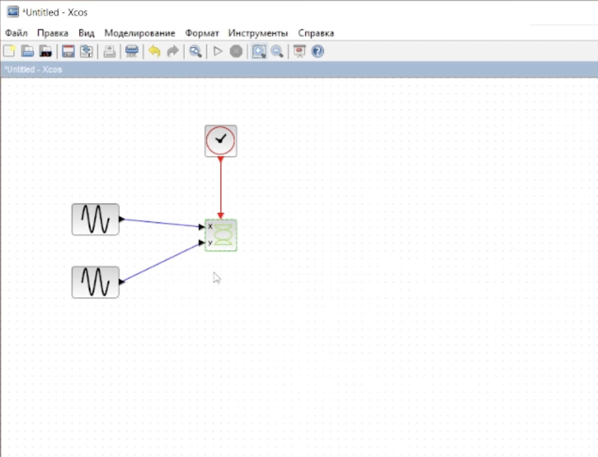
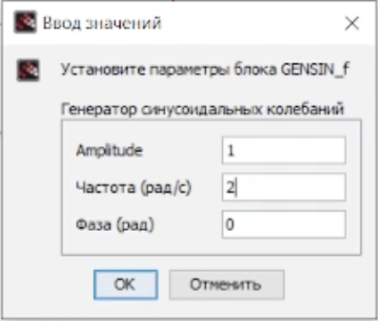
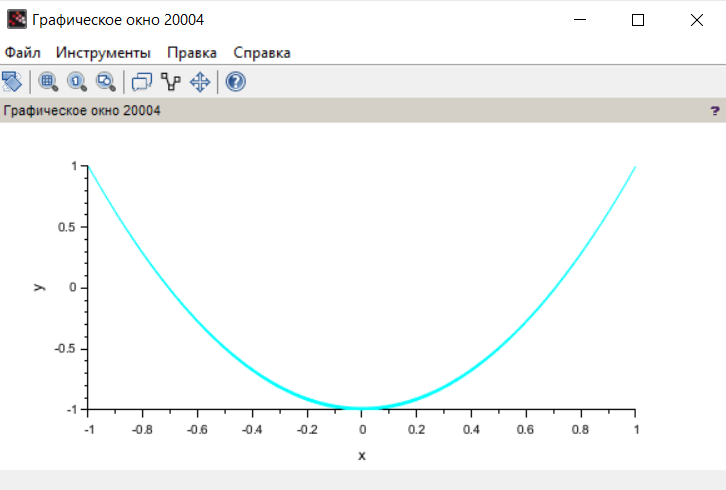
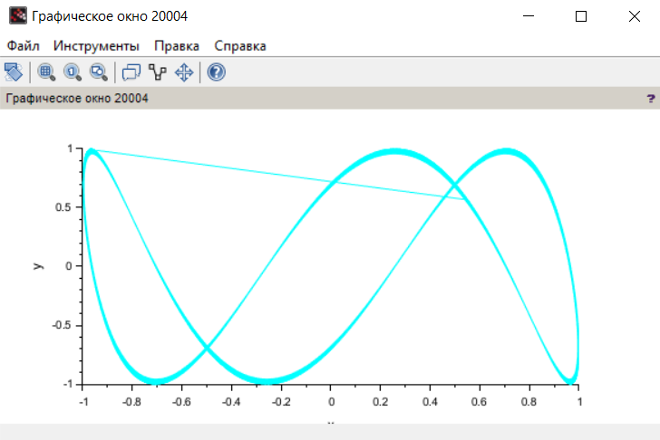
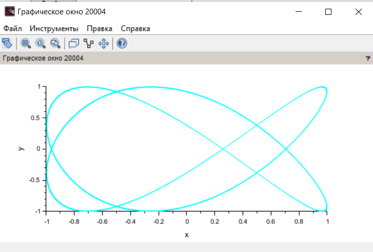

---
## Front matter
title: "Упражнение: построить фигуры Лиссажу"
subtitle: "Задание для самостоятельного выполнения"
author: "Ланцова Яна Игоревна"

## Generic otions
lang: ru-RU
toc-title: "Содержание"

## Bibliography
bibliography: bib/cite.bib
csl: pandoc/csl/gost-r-7-0-5-2008-numeric.csl

## Pdf output format
toc: true # Table of contents
toc-depth: 2
lof: true # List of figures
lot: true # List of tables
fontsize: 12pt
linestretch: 1.5
papersize: a4
documentclass: scrreprt
## I18n polyglossia
polyglossia-lang:
  name: russian
  options:
    - spelling=modern
    - babelshorthands=true
polyglossia-otherlangs:
  name: english
## I18n babel
babel-lang: russian
babel-otherlangs: english
## Fonts
mainfont: IBM Plex Serif
romanfont: IBM Plex Serif
sansfont: IBM Plex Sans
monofont: IBM Plex Mono
mathfont: STIX Two Math
mainfontoptions: Ligatures=Common,Ligatures=TeX,Scale=0.94
romanfontoptions: Ligatures=Common,Ligatures=TeX,Scale=0.94
sansfontoptions: Ligatures=Common,Ligatures=TeX,Scale=MatchLowercase,Scale=0.94
monofontoptions: Scale=MatchLowercase,Scale=0.94,FakeStretch=0.9
mathfontoptions:
## Biblatex
biblatex: true
biblio-style: "gost-numeric"
biblatexoptions:
  - parentracker=true
  - backend=biber
  - hyperref=auto
  - language=auto
  - autolang=other*
  - citestyle=gost-numeric
## Pandoc-crossref LaTeX customization
figureTitle: "Рис."
tableTitle: "Таблица"
listingTitle: "Листинг"
lofTitle: "Список иллюстраций"
lotTitle: "Список таблиц"
lolTitle: "Листинги"
## Misc options
indent: true
header-includes:
  - \usepackage{indentfirst}
  - \usepackage{float} # keep figures where there are in the text
  - \floatplacement{figure}{H} # keep figures where there are in the text
---

# Цель работы

Выполнить задание для самостоятельного выполнения.

# Задание

Постройте с помощью xcos фигуры Лиссажу со следующими параметрами:

1) $A = B = 1, a = 2, b = 2, \, \delta = 0; \, \pi/4; \, \pi/2; \,  3\pi/4;\,  \pi;$

2) $A = B = 1, a = 2, b = 4, \, \delta = 0; \, \pi/4; \, \pi/2; \, 3\pi/4; \, \pi;$

3) $A = B = 1, a = 2, b = 6, \, \delta = 0; \, \pi/4; \, \pi/2; \, 3π/4; \, π;$

4) $A = B = 1, a = 2, b = 3, \, \delta = 0; \, \pi/4; \, \pi/2; \, 3\pi/4; \, \pi.$

# Выполнение лабораторной работы

Математическое выражение для кривой Лиссажу:
$$
\begin{cases}
  x(t) = A sin(at + \delta),\\
  y(t) = B sin(bt),
\end{cases}
$$
где $A, B$ -- амплитуды колебаний, $a, b$ -- частоты, $\delta$ -- сдвиг фаз.
В модели будут использованы следующие блоки xcos:
- CLOCK_c -- запуск часов модельного времени;
- GENSIN_f -- блок генератора синусоидального сигнала;
- CSOPXY -- анимированное регистрирующее устройство для построения графика
типа y = f(x);
- TEXT_f -- задаёт текст примечаний.

Откроем меню Scilab (рис. [-@fig:001]).

{#fig:001 width=70%}

Откроем Xcos и разместим устройства и блоки следующим образом (рис. [-@fig:002]).

{#fig:002 width=70%}

Щелкнув правой кнопкой мышки по генератору синусоидальный колебаний, откроем вкладку параметры на редактирование и внесем нужные данные (рис. [-@fig:003]). 

{#fig:003 width=70%}

Таким же образом введем параметры в регистрирующее устройство

Выполнив моделирование получим следующий график фигуры Лиссажу при параметрах: $A = B = 1, a = 2, b = 2, \delta = 0$ (рис. [-@fig:004]). Также поменяем фазу на первом генераторе на $\pi/4; \, \pi/2; \,  3\pi/4;\,  \pi;$ соответственно получим другие фигуры Лиссажу (рис. [-@fig:005]-[-@fig:007])

{#fig:004 width=70%}

{#fig:005 width=70%}

{#fig:006 width=70%}

{#fig:007 width=70%}

{#fig:008 width=70%}

Изменив параметры и выполнив моделирование получим следующий график фигуры Лиссажу при параметрах: $A = B = 1, a = 2, b = 4, \delta = 0$ (рис. [-@fig:009]). Меняя фазу в первом генераторе на $\pi/4; \, \pi/2; \,  3\pi/4;\,  \pi;$ соответственно получим другие фигуры Лиссажу (рис. [-@fig:010]-[-@fig:013])

{#fig:009 width=70%}

{#fig:010 width=70%}

{#fig:011 width=70%}

{#fig:012 width=70%}

{#fig:013 width=70%}

Изменив параметры и выполнив моделирование получим следующий график фигуры Лиссажу при параметрах: $A = B = 1, a = 2, b = 6, \delta = 0$ (рис. [-@fig:014]). Аналогично предыдущим пунктам меняем фазу в первом генераторе (рис. [-@fig:015]-[-@fig:018]).

{#fig:014 width=70%}

{#fig:015 width=70%}

{#fig:016 width=70%}

{#fig:017 width=70%}

{#fig:018 width=70%}

Изменив параметры и выполнив моделирование получим следующий график фигуры Лиссажу при параметрах: $A = B = 1, a = 2, b = 4, \delta = 0$ (рис. [-@fig:019]). Аналогично предыдущим пунктам меняем фазу в первом генераторе (рис. [-@fig:020]-[-@fig:023]).

{#fig:019 width=70%}

{#fig:020 width=70%}

{#fig:021 width=70%}

{#fig:022 width=70%}

{#fig:023 width=70%}

# Выводы

В результате выполнения данной лабораторной работы я выполнила упражнение по ознакомлению с программой *xcos*.
