---
## Front matter
title: "Лабораторная работа №5"
subtitle: "Модель эпидемии (SIR)"
author: "Ланцова Яна Игоревна"

## Generic otions
lang: ru-RU
toc-title: "Содержание"

## Bibliography
bibliography: bib/cite.bib
csl: pandoc/csl/gost-r-7-0-5-2008-numeric.csl

## Pdf output format
toc: true # Table of contents
toc-depth: 2
lof: true # List of figures
lot: true # List of tables
fontsize: 12pt
linestretch: 1.5
papersize: a4
documentclass: scrreprt
## I18n polyglossia
polyglossia-lang:
  name: russian
  options:
    - spelling=modern
    - babelshorthands=true
polyglossia-otherlangs:
  name: english
## I18n babel
babel-lang: russian
babel-otherlangs: english
## Fonts
mainfont: IBM Plex Serif
romanfont: IBM Plex Serif
sansfont: IBM Plex Sans
monofont: IBM Plex Mono
mathfont: STIX Two Math
mainfontoptions: Ligatures=Common,Ligatures=TeX,Scale=0.94
romanfontoptions: Ligatures=Common,Ligatures=TeX,Scale=0.94
sansfontoptions: Ligatures=Common,Ligatures=TeX,Scale=MatchLowercase,Scale=0.94
monofontoptions: Scale=MatchLowercase,Scale=0.94,FakeStretch=0.9
mathfontoptions:
## Biblatex
biblatex: true
biblio-style: "gost-numeric"
biblatexoptions:
  - parentracker=true
  - backend=biber
  - hyperref=auto
  - language=auto
  - autolang=other*
  - citestyle=gost-numeric
## Pandoc-crossref LaTeX customization
figureTitle: "Рис."
tableTitle: "Таблица"
listingTitle: "Листинг"
lofTitle: "Список иллюстраций"
lotTitle: "Список таблиц"
lolTitle: "Листинги"
## Misc options
indent: true
header-includes:
  - \usepackage{indentfirst}
  - \usepackage{float} # keep figures where there are in the text
  - \floatplacement{figure}{H} # keep figures where there are in the text
---

# Цель работы

Построить модель SIR в *xcos* и OpenModelica.

# Задание

1. Реализовать модель SIR в в *xcos*;
2. Реализовать модель SIR с помощью блока Modelica в в *xcos*;
3. Реализовать модель SIR в OpenModelica;
4. Реализовать модель SIR с учётом процесса рождения / гибели особей в xcos (в том числе и с использованием блока Modelica), а также в OpenModelica;
5. Построить графики эпидемического порога при различных значениях параметров модели (в частности изменяя параметр $\mu$);
6. Сделать анализ полученных графиков в зависимости от выбранных значений параметров модели.

# Выполнение лабораторной работы

Задача о распространении эпидемии описывается системой дифференциальных уравнений:

$$
\begin{cases}
  \dot s = - \beta s(t)i(t); \\
  \dot i = \beta s(t)i(t) - \nu i(t);\\
  \dot r = \nu i(t),
\end{cases}
$$

где $\beta$ -- скорость заражения, $\nu$ -- скорость выздоровления.

Для реализации модели (рис. [-@fig:001]) потребуются следующие блоки xcos:

- `CLOCK_c` -- запуск часов модельного времени;
- `CSCOPE` -- регистрирующее устройство для построения графика;
- `TEXT_f` -- задаёт текст примечаний;
- `MUX` -- мультиплексер, позволяющий в данном случае вывести на графике сразу
несколько кривых;
- `INTEGRAL_m` -- блок интегрирования;
- `GAINBLK_f` -- в данном случае позволяет задать значения коэффициентов $\beta$ и $\nu$ ;
- `SUMMATION` -- блок суммирования;
- `PROD_f` -- поэлементное произведение двух векторов на входе блока.

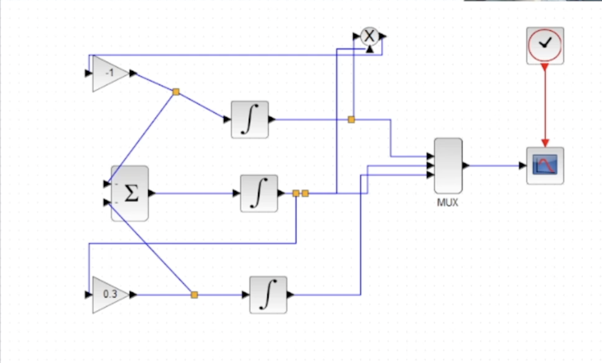{#fig:001 width=70%}

В параметрах верхнего и среднего блока интегрирования необходимо задать начальные значения $s(0) = 0,999$ и $i(0) = 0,001$ (рис. [-@fig:002] - [-@fig:003]).

{#fig:002 width=70%}

{#fig:003 width=70%}

В меню Моделирование, Установка зададим конечное время интегрирования, равным времени моделирования, в данном случае 30 (рис. [-@fig:004])

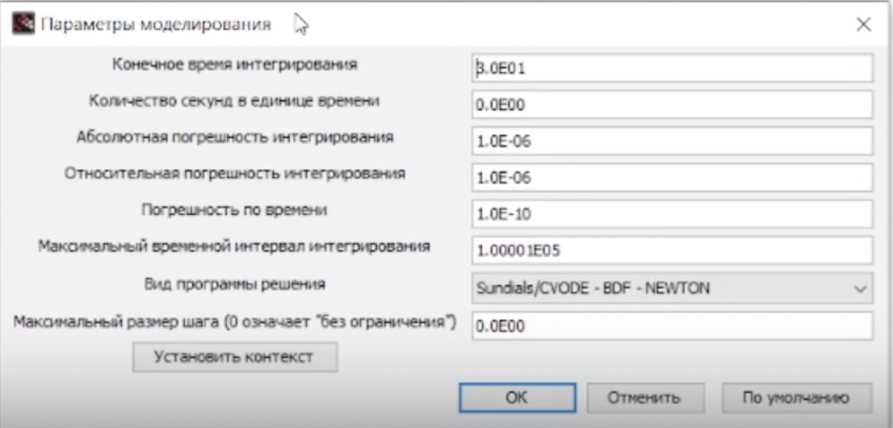{#fig:004 width=70%}

Результат моделирования представлен на рис. [-@fig:005]. Черной линией обозначен график $s(t)$ (динамика численности уязвимых к болезни особей), красная линия определяет $r(t)$ — динамику численности выздоровевших особей, наконец, зеленая линия определяет $i(t)$ — динамику численности заражённых особей. Пересечение трёх линий определяет порог эпидемии.

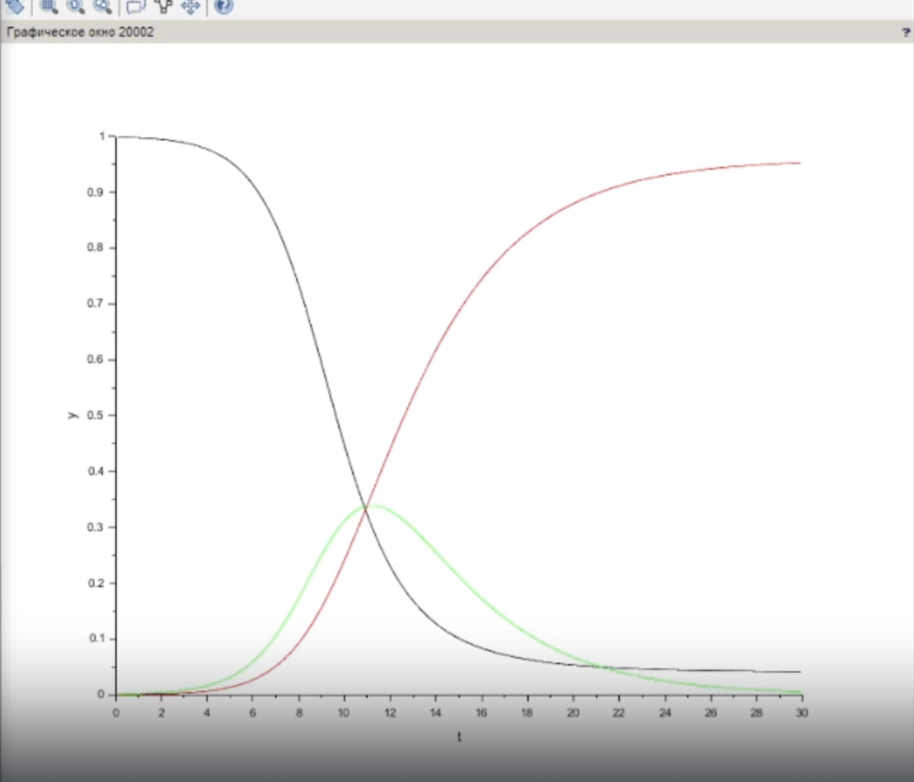{#fig:005 width=70%}

Реализуем модель с помощью блока Modelica в xcos. Готовая модель SIR представлена на рис [-@fig:006].

Для реализации модели SIR с помощью языка Modelica помимо блоков `CLOCK_c`,
`CSCOPE`, `TEXT_f` и `MUX` требуются блоки `CONST_m` — задаёт константу; `MBLOCK`
(Modelica generic) — блок реализации кода на языке Modelica.

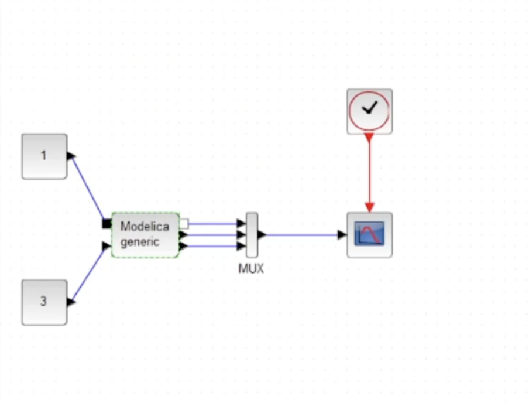{#fig:006 width=70%}

Параметры блока Modelica представлены на рис. [-@fig:007],[-@fig:008]. Переменные на входе (“beta”, “nu”) и выходе (“s”, “i”, “r”) блока заданы как внешние (“E”).

{#fig:007 width=70%}

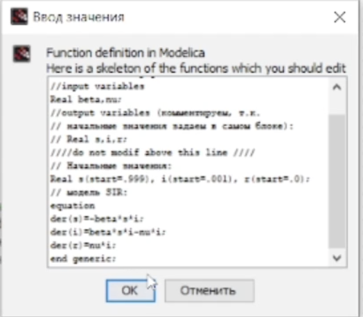{#fig:008 width=70%}

В результате получаем график (рис. [-@fig:009]), построенный с помощью блока Modelica идентичный графику (рис. [-@fig:005]), построенному без них.

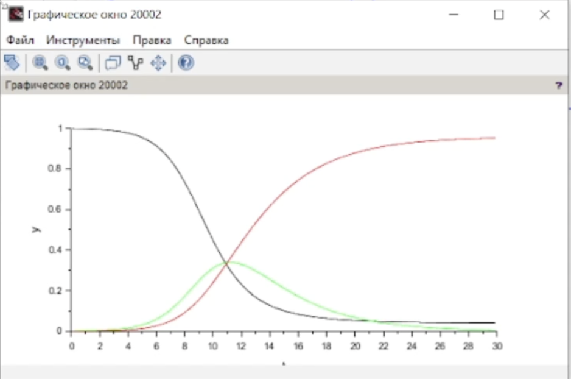{#fig:009 width=70%}

В качестве упражнения необходимо построить модель SIR на OpenModelica. Синтаксис почти такой же как и на Modelica. Нужно задать параметры, начальные значения и систему дифференциальных уравнений. Код представлен ниже (рис. [-@fig:010])

{#fig:010 width=70%}

Теперь выполним симуляции, задав конечное время 30 с. В результате получаем следующий график (рис. [-@fig:011]).

{#fig:011 width=70%}

## Задание для самостоятельного выполнения

Предположим, что в модели SIR учитываются демографические процессы, в частности, что смертность в популяции полностью уравновешивает рождаемость, а все рожденные индивидуумы появляются на свет абсолютно здоровыми. Тогда получим следующую систему уравнений:

$$
\begin{cases}
  \dot s = - \beta s(t)i(t) + \mu (N - s(t)); \\
  \dot i = \beta s(t)i(t) - \nu i(t) - \mu i(t);\\
  \dot r = \nu i(t) - \mu r(t),
\end{cases}
$$

где $\mu$ — константа, которая равна коэффициенту смертности и рождаемости.

Реализуем эту модель в *xcos*. Тут нам понадобятся три блока суммирования и 4 блока констант (добавляется константа $\nu$) (рис. [-@fig:012]).

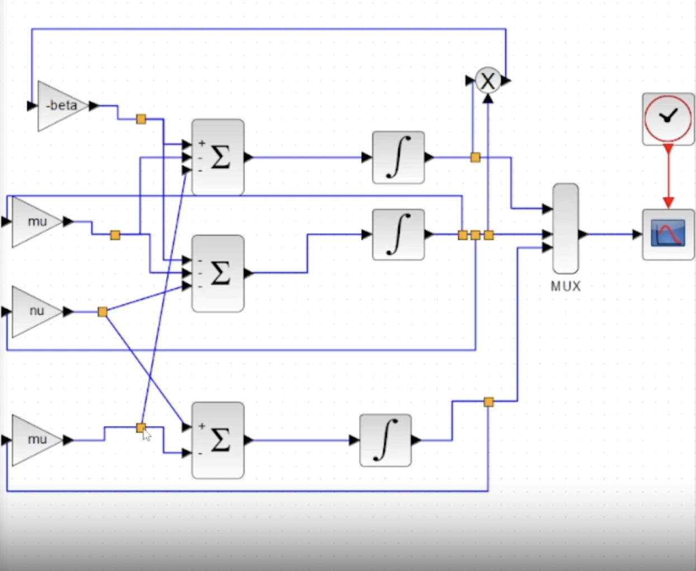{#fig:012 width=70%}

Получим следующий график (рис. [-@fig:013]).

{#fig:013 width=70%}

Теперь реализуем модель SIR с учетом демографических процессов в *xcos* с помощью блоков Modelica (рис. [-@fig:014]).

{#fig:014 width=70%}

Параметры блока Modelica представлены на рис. [-@fig:015],[-@fig:016]. Переменные на входе (“beta”, “nu”, “mu” ) и выходе (“s”, “i”, “r”) блока заданы как внешние (“E”).

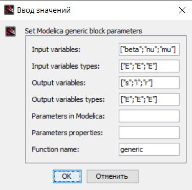{#fig:015 width=70%}

{#fig:016 width=70%}

В результате получаем следующий график (рис. [-@fig:017]).

{#fig:017 width=70%}

Реализуем модель SIR с учетом демографических процессов на OpenModelica. (рис. [-@fig:018]).

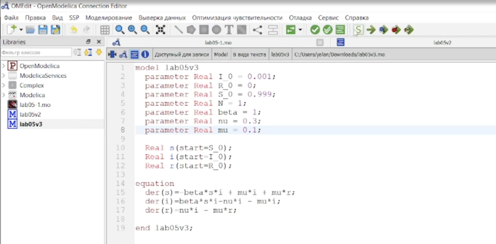{#fig:018 width=70%}

Выполнив симуляцию, получим следующий график (рис. [-@fig:019]).

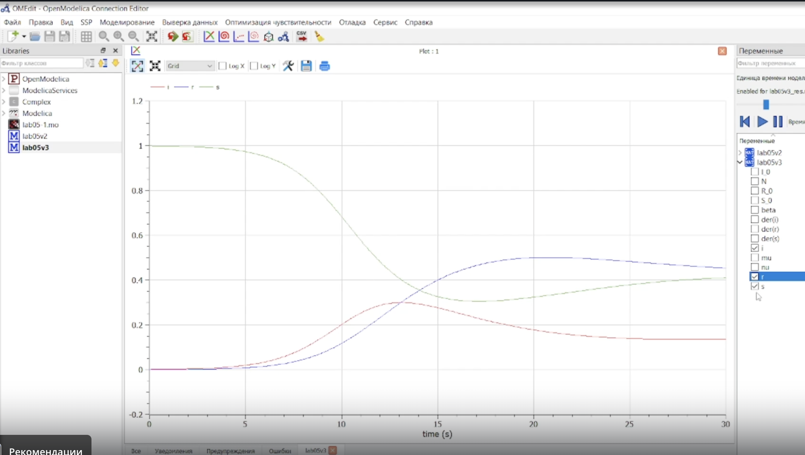{#fig:019 width=70%}

Теперь построим графики при разных значениях параметров. (рис. [-@fig:020]-[-@fig:021]).

{#fig:020 width=70%}

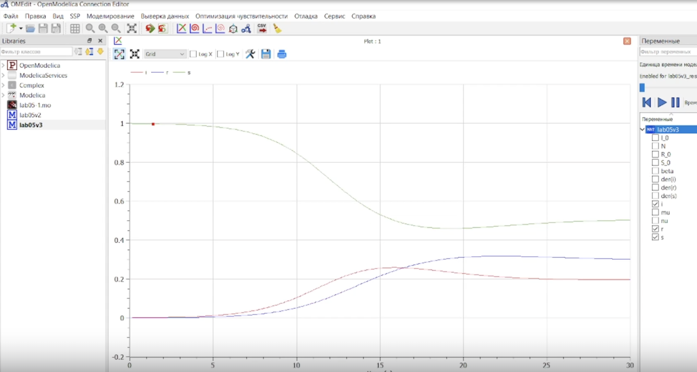{#fig:021 width=70%}

# Выводы

В процессе выполнения данной лабораторной работы была построена модель SIR в *xcos* и OpenModelica.
