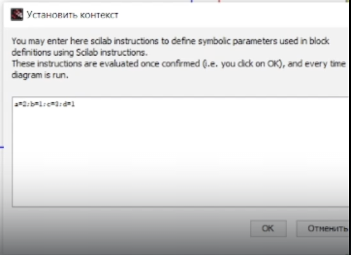
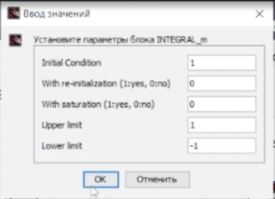
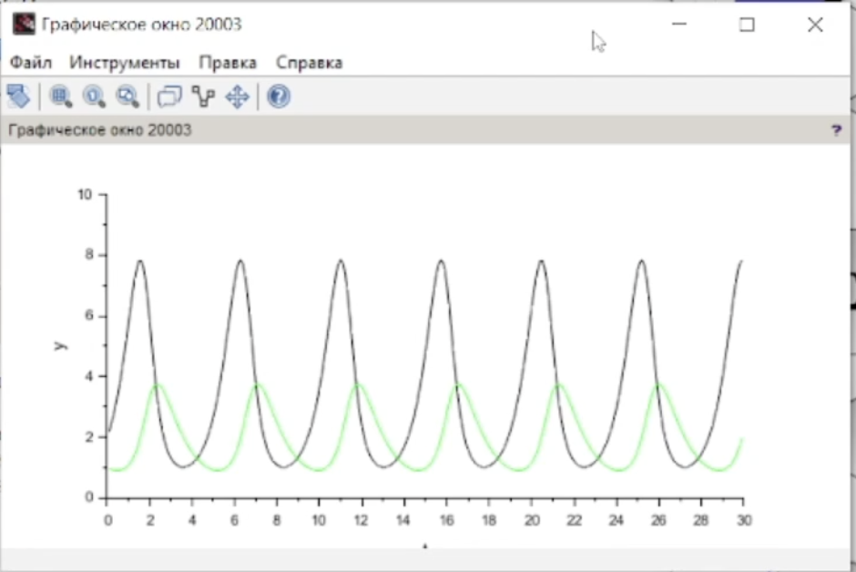
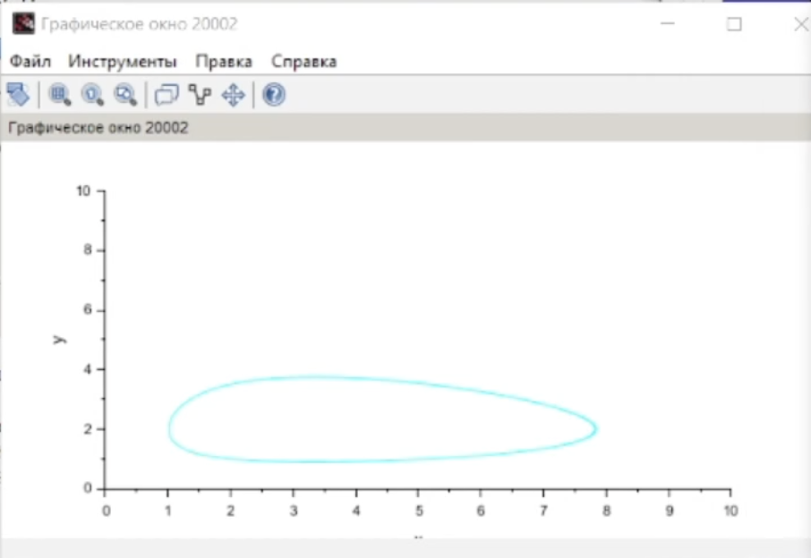
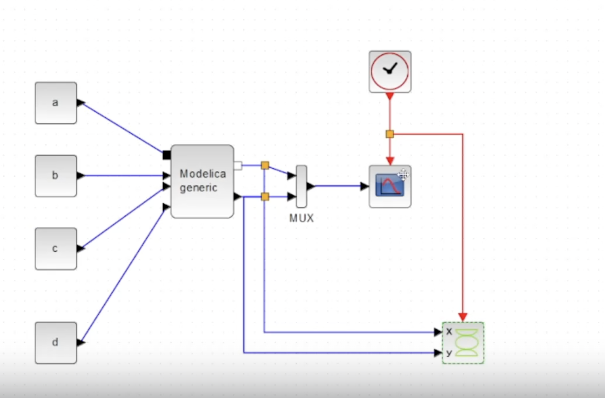
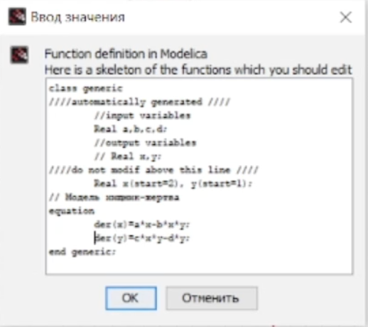
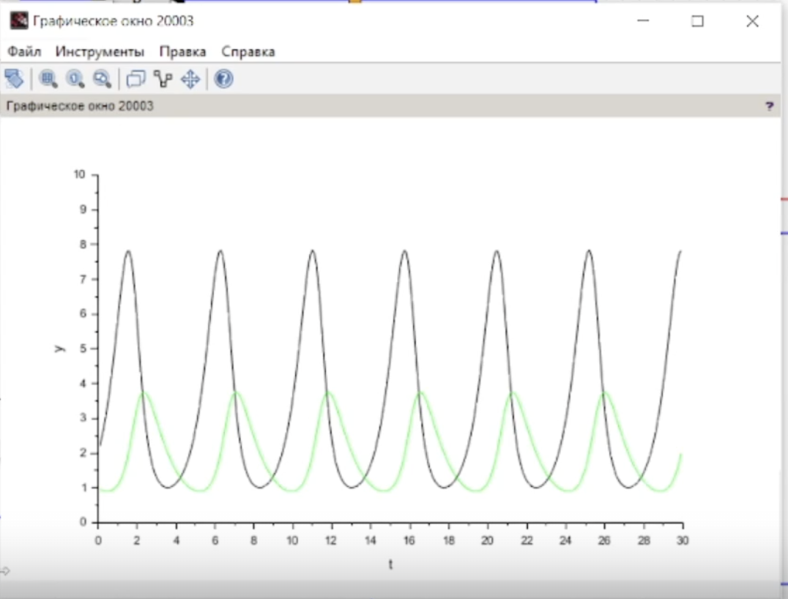
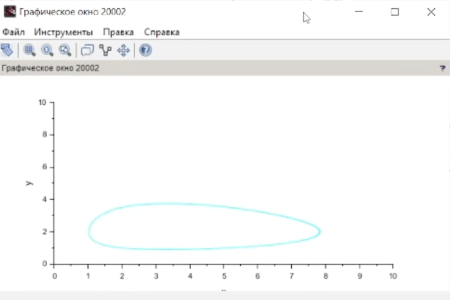
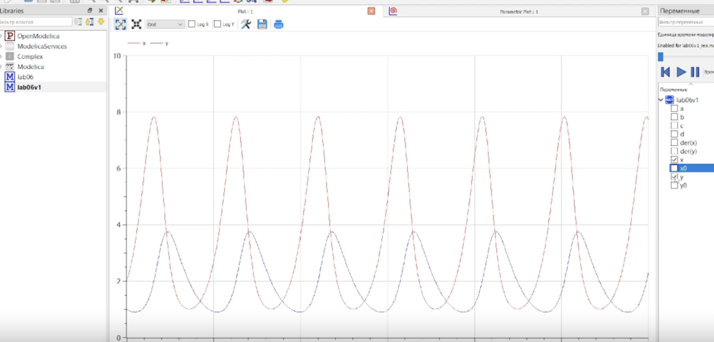

---
## Front matter
lang: ru-RU
title: Лабораторная работа 6
subtitle: модель "хищник-жертва"
author:
  - Ланцова Я. И.
institute:
  - Российский университет дружбы народов, Москва, Россия

## i18n babel
babel-lang: russian
babel-otherlangs: english

## Formatting pdf
toc: false
toc-title: Содержание
slide_level: 2
aspectratio: 169
section-titles: true
theme: metropolis
header-includes:
 - \metroset{progressbar=frametitle,sectionpage=progressbar,numbering=fraction}
    

---

# Информация

## Докладчик

:::::::::::::: {.columns align=center}
::: {.column width="70%"}

  * Ланцова Яна Игоревна
  * студентка
  * Российский университет дружбы народов

:::
::::::::::::::

## Цель работы

Реализовать модель "хищник-жертва" в *xcos*.

## Задание

- Реализовать модель "хищник-жертва" в xcos;
- Реализовать модель "хищник-жертва" с помощью блока Modelica в xcos;
- Реализовать модель "хищник-жертва" в OpenModelica

# Выполнение лабораторной работы

## Выполнение лабораторной работы

$$
\begin{cases}
  \dot x = ax - bxy \\
  \dot y = cxy - dy,
\end{cases}
$$

где $x$ — количество жертв; $y$ — количество хищников; $a, b, c, d$ — коэффициенты, отражающие взаимодействия между видами.

## Выполнение лабораторной работы

Для реализации модели "хищник-жертва" в дополнение к блокам `CLOCK_c`, `CSCOPE`, `TEXT_f`, `MUX`, `INTEGRAL_m`, `GAINBLK_f`, `SUMMATION`, `PROD_f` потребуется блок `CSCOPXY` -- регистрирующее устройство для построения фазового портрета. 

## Выполнение лабораторной работы

{#fig:001 width=60%}

## Выполнение лабораторной работы

{#fig:002 width=50%}

## Выполнение лабораторной работы

{#fig:003 width=60%}

## Выполнение лабораторной работы

{#fig:004 width=60%}

## Выполнение лабораторной работы

{#fig:005 width=60%}

## Выполнение лабораторной работы

{#fig:006 width=60%}

## Выполнение лабораторной работы

{#fig:007 width=70%}

## Выполнение лабораторной работы

{#fig:008 width=40%}

## Выполнение лабораторной работы

{#fig:009 width=50%}

## Выполнение лабораторной работы

{#fig:010 width=50%}

## Выполнение лабораторной работы

{#fig:011 width=70%}

## Выполнение лабораторной работы

{#fig:012 width=70%}

## Выполнение лабораторной работы

{#fig:013 width=70%}

## Выполнение лабораторной работы

{#fig:014 width=70%}

## Выводы

В процессе выполнения данной лабораторной реализована модель "хищник-жертва" в *xcos*.
