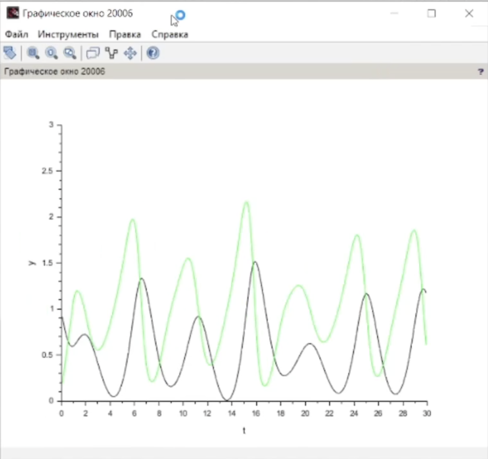
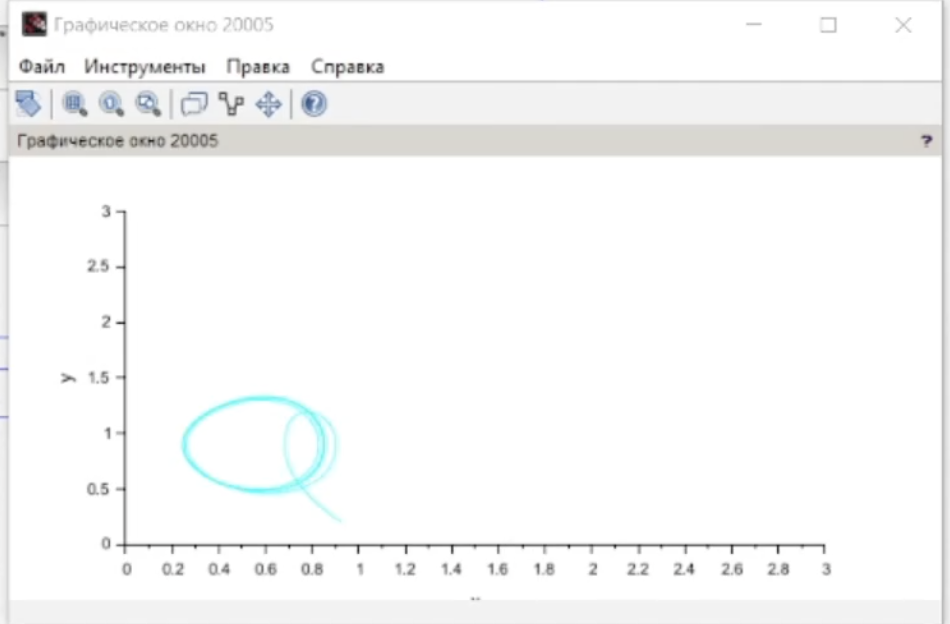
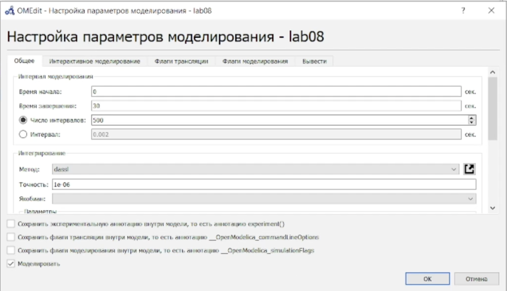
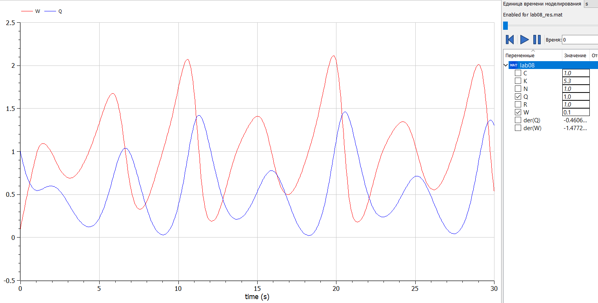
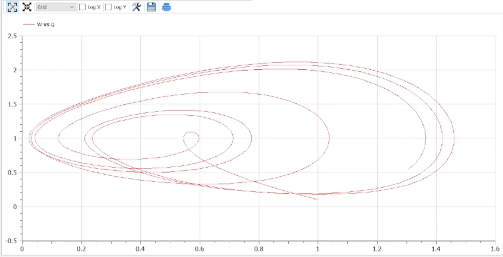

---
## Front matter
lang: ru-RU
title: Лабораторная работа 8
subtitle: Модель TCP/AQM
author:
  - Ланцова Я. И.
institute:
  - Российский университет дружбы народов, Москва, Россия

## i18n babel
babel-lang: russian
babel-otherlangs: english

## Formatting pdf
toc: false
toc-title: Содержание
slide_level: 2
aspectratio: 169
section-titles: true
theme: metropolis
header-includes:
 - \metroset{progressbar=frametitle,sectionpage=progressbar,numbering=fraction}
    

---

# Информация

## Докладчик

:::::::::::::: {.columns align=center}
::: {.column width="70%"}

  * Ланцова Яна Игоревна
  * студентка
  * Российский университет дружбы народов

:::
::::::::::::::

## Цель работы

Реализовать модель TCP/AQM с помощью xcos и OpenModelica.

## Задание

- Реализовать в xcos и OpenModelica модель TCP/AQM.
- Построить график, описывающий динамику размера очереди и TCP окна
- Построить фазовый портрет, описывающий зависимость размера очереди от TCP окна

# Выполнение лабораторной работы

## Выполнение лабораторной работы

## Выполнение лабораторной работы

{#fig:001 width=70%}

## Выполнение лабораторной работы

{#fig:002 width=70%}

## Выполнение лабораторной работы

{#fig:003 width=70%}

## Выполнение лабораторной работы

{#fig:004 width=70%}

## Выполнение лабораторной работы

{#fig:005 width=70%}

## Выполнение лабораторной работы

{#fig:006 width=70%}

## Выполнение лабораторной работы

{#fig:007 width=70%}

## Выполнение лабораторной работы

{#fig:008 width=70%}

## Выполнение лабораторной работы

{#fig:009 width=70%}

## Выполнение лабораторной работы

{#fig:010 width=70%}

## Выводы

В результате выполнения работы была реализована модель $M|M|1|\infty$ с помощью xcos.
