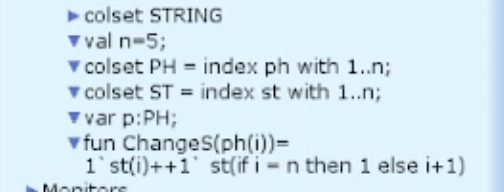
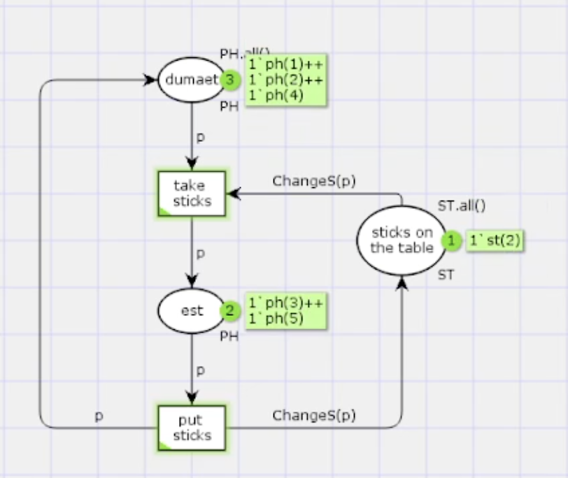
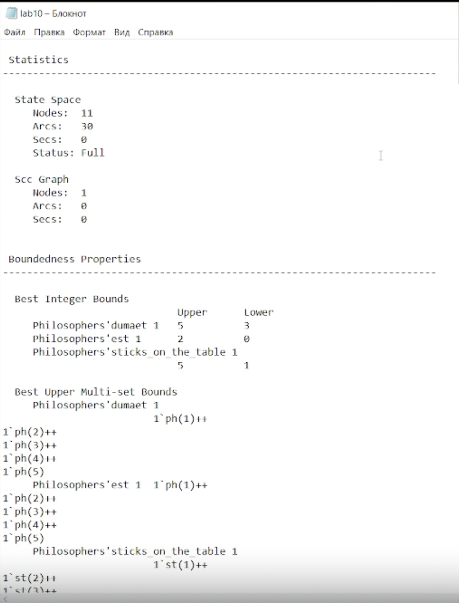

---
## Front matter
title: "Лабораторная работа №10"
subtitle: "Задача об обедающих мудрецах"
author: "Ланцова Яна Игоревна"

## Generic otions
lang: ru-RU
toc-title: "Содержание"

## Bibliography
bibliography: bib/cite.bib
csl: pandoc/csl/gost-r-7-0-5-2008-numeric.csl

## Pdf output format
toc: true # Table of contents
toc-depth: 2
lof: true # List of figures
lot: true # List of tables
fontsize: 12pt
linestretch: 1.5
papersize: a4
documentclass: scrreprt
## I18n polyglossia
polyglossia-lang:
  name: russian
  options:
    - spelling=modern
    - babelshorthands=true
polyglossia-otherlangs:
  name: english
## I18n babel
babel-lang: russian
babel-otherlangs: english
## Fonts
mainfont: IBM Plex Serif
romanfont: IBM Plex Serif
sansfont: IBM Plex Sans
monofont: IBM Plex Mono
mathfont: STIX Two Math
mainfontoptions: Ligatures=Common,Ligatures=TeX,Scale=0.94
romanfontoptions: Ligatures=Common,Ligatures=TeX,Scale=0.94
sansfontoptions: Ligatures=Common,Ligatures=TeX,Scale=MatchLowercase,Scale=0.94
monofontoptions: Scale=MatchLowercase,Scale=0.94,FakeStretch=0.9
mathfontoptions:
## Biblatex
biblatex: true
biblio-style: "gost-numeric"
biblatexoptions:
  - parentracker=true
  - backend=biber
  - hyperref=auto
  - language=auto
  - autolang=other*
  - citestyle=gost-numeric
## Pandoc-crossref LaTeX customization
figureTitle: "Рис."
tableTitle: "Таблица"
listingTitle: "Листинг"
lofTitle: "Список иллюстраций"
lotTitle: "Список таблиц"
lolTitle: "Листинги"
## Misc options
indent: true
header-includes:
  - \usepackage{indentfirst}
  - \usepackage{float} # keep figures where there are in the text
  - \floatplacement{figure}{H} # keep figures where there are in the text
---

# Цель работы

Реализовать в CPN Tools задачу об обедающих мудрецах.

# Задание

- Реализовать в CPN Tools задачу об обедающих мудрецах.
- Вычислить пространство состояний, сформировать отчет о нем и построить граф.

# Выполнение лабораторной работы

Пять мудрецов сидят за круглым столом и могут пребывать в двух состояниях -- думать и есть. Между соседями лежит одна палочка для еды. Для приёма пищи необходимы две палочки. Палочки — пересекающийся ресурс. Необходимо синхронизировать процесс еды так, чтобы мудрецы не умерли с голода.

Начальные данные:
- позиции: мудрец размышляет (dumaet), мудрец ест (est) палочки находятся на столе (sticks on the table)
- переходы: взять палочки (take sticks), положить палочки (put sticks)

Рисуем граф сети. Для этого с помощью контекстного меню создаём новую сеть, добавляем позиции, переходы и дуги (рис. [-@fig:001]).

{#fig:001 width=70%}

В меню заданы новые декларации модели: типы фишек, начальные значения позиций, выражения для дуг (рис. [-@fig:002]):
- n -- число мудрецов и палочек (n = 5);
- p -- фишки, обозначающие мудрецов, имеют перечисляемый тип PH от 1 до n;
- s -- фишки, обозначающие палочки, имеют перечисляемый тип ST от 1 до n;
- функция ChangeS(p) ставит в соответствие мудрецам палочки (возвращает номера палочек, используемых мудрецами); по условию задачи мудрецы сидят по кругу и мудрец p(i) может взять i и i + 1 палочки:

{#fig:002 width=70%}

После запуска модели наблюдаем, что одновременно палочками могут воспользоваться только два из пяти мудрецов(рис. [-@fig:003]):

{#fig:003 width=70%}

Сформируем граф пространства состояний, всего их 11(рис. [-@fig:004]):

{#fig:004 width=70%}

Затем сформируем отчет пространства состояний(рис. [-@fig:005]). Из него может увидеть:

- есть 11 состояний и 30 переходов между ними.
- Затем указаны границы значений для каждого элемента: думающие мудрецы (максимум - 5, минимум - 3), мудрецы едят (максимум - 2, минимум - 0), палочки на столе (максимум - 5, минимум - 1, минимальное значение 2, так как в конце симуляции остаются пирожки).
- Также указаны границы в виде мультимножеств.
- Маркировка home для всех состояний, так как в любую позицию мы можем попасть из любой другой маркировки.
- Маркировка dead равная None, так как нет состояний, из которых переходов быть не может.
- В конце указано, что бесконечно часто происходят события положить и взять палочку.

{#fig:005 width=70%}

# Выводы

В результате выполнения работы была реализована в CPN Tools задача об обедающих мудрецах.
