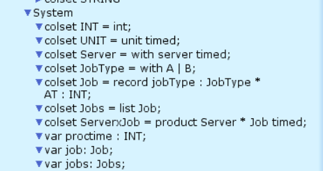
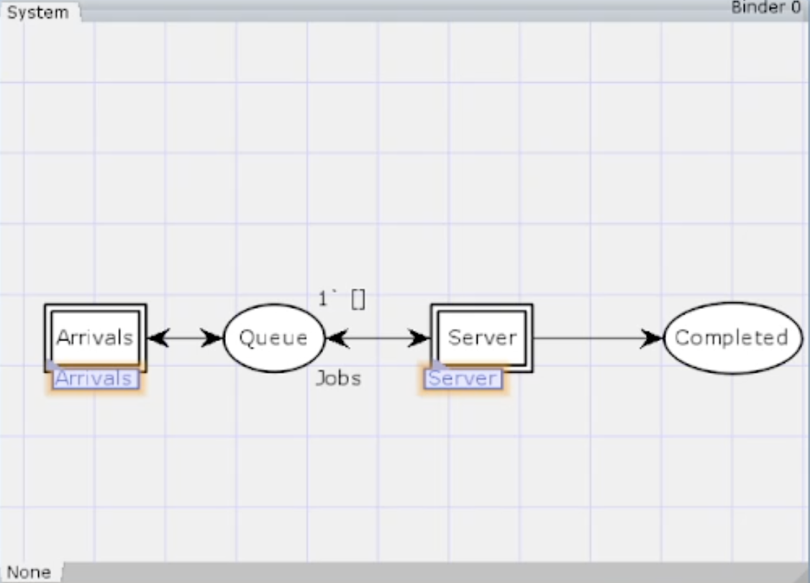
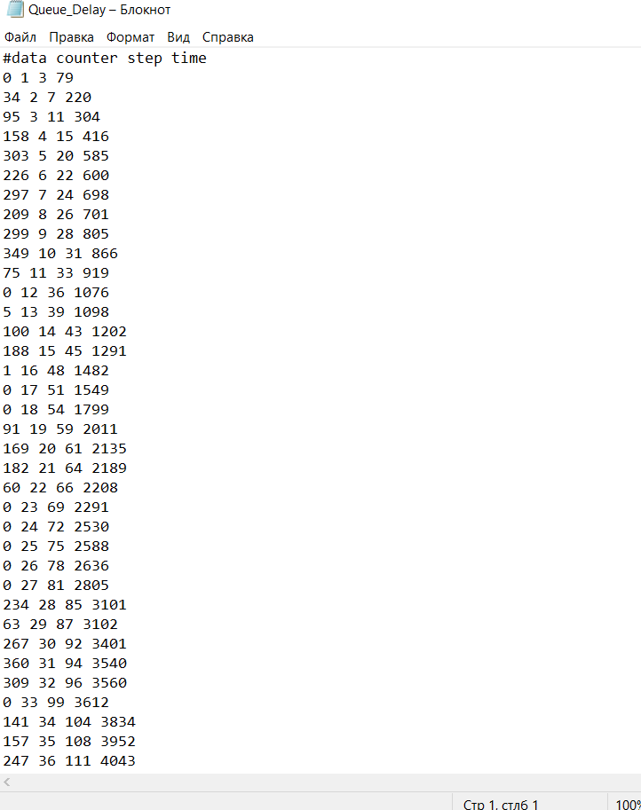
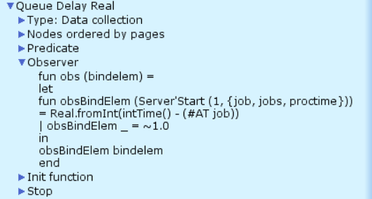
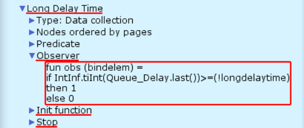

---
## Front matter
title: "Лабораторная работа №11"
subtitle: "Модель системы массового обслуживания M|M|1"
author: "Ланцова Яна Игоревна"

## Generic otions
lang: ru-RU
toc-title: "Содержание"

## Bibliography
bibliography: bib/cite.bib
csl: pandoc/csl/gost-r-7-0-5-2008-numeric.csl

## Pdf output format
toc: true # Table of contents
toc-depth: 2
lof: true # List of figures
lot: true # List of tables
fontsize: 12pt
linestretch: 1.5
papersize: a4
documentclass: scrreprt
## I18n polyglossia
polyglossia-lang:
  name: russian
  options:
    - spelling=modern
    - babelshorthands=true
polyglossia-otherlangs:
  name: english
## I18n babel
babel-lang: russian
babel-otherlangs: english
## Fonts
mainfont: IBM Plex Serif
romanfont: IBM Plex Serif
sansfont: IBM Plex Sans
monofont: IBM Plex Mono
mathfont: STIX Two Math
mainfontoptions: Ligatures=Common,Ligatures=TeX,Scale=0.94
romanfontoptions: Ligatures=Common,Ligatures=TeX,Scale=0.94
sansfontoptions: Ligatures=Common,Ligatures=TeX,Scale=MatchLowercase,Scale=0.94
monofontoptions: Scale=MatchLowercase,Scale=0.94,FakeStretch=0.9
mathfontoptions:
## Biblatex
biblatex: true
biblio-style: "gost-numeric"
biblatexoptions:
  - parentracker=true
  - backend=biber
  - hyperref=auto
  - language=auto
  - autolang=other*
  - citestyle=gost-numeric
## Pandoc-crossref LaTeX customization
figureTitle: "Рис."
tableTitle: "Таблица"
listingTitle: "Листинг"
lofTitle: "Список иллюстраций"
lotTitle: "Список таблиц"
lolTitle: "Листинги"
## Misc options
indent: true
header-includes:
  - \usepackage{indentfirst}
  - \usepackage{float} # keep figures where there are in the text
  - \floatplacement{figure}{H} # keep figures where there are in the text
---

# Цель работы

Реализовать в CPN Tools модель системы массового обслуживания M|M|1.

# Задание

- Реализовать в CPN Tools модель системы массового обслуживания M|M|1.
- Настроить мониторинг параметров моделируемой системы и нарисовать графики очереди.

# Выполнение лабораторной работы

## Реализация модели системы массового обслуживания M|M|1 в CPN Tools

Зададим декларации системы(рис. [-@fig:001]).

- фишки типа UNIT определяют моменты времени;
- фишки типа INT определяют моменты поступления заявок в систему.
- фишки типа JobType определяют 2 типа заявок — A и B;
- кортеж Job имеет 2 поля: jobType определяет тип работы, соответственно имеет тип JobType, поле AT имеет тип INT и используется для хранения времени нахождения заявки в системе;
- фишки Jobs — список заявок;
- фишки типа ServerxJob — определяют состояние сервера, занятого обработкой заявок.
Переменные модели:
- proctime — определяет время обработки заявки;
- job — определяет тип заявки;
- jobs — определяет поступление заявок в очередь

{#fig:001 width=70%}

Также зададим функции (рис. [-@fig:002]) expTime (описывает генерацию целочисленных значений через интервалы времени, распределённые по экспоненциальному закону), intTime (преобразует текущее модельное время в целое число), newJob (возвращает значение из набора Job — случайный выбор типа заявки).

{#fig:002 width=70%}

Модель состоит из трех отдельных листов: на первом листе опишем граф системы(рис. [-@fig:003]), на втором — генератор заявок (рис. [-@fig:004]):, на третьем — сервер обработки заявок (рис. [-@fig:005]).

Сеть имеет 2 позиции (очередь — Queue, обслуженные заявки — Complited) и два перехода (генерировать заявку — Arrivals, передать заявку на обработку серверу - Server). Переходы имеют сложную иерархическую структуру, задаваемую на отдельных листах модели (с помощью соответствующего инструмента меню - Hierarchy).

Между переходом Arrivals и позицией Queue, а также между позицией Queue и переходом Server установлена дуплексная связь. Между переходом Server и позицией Complited — односторонняя связь. 

Граф генератора заявок имеет 3 позиции (текущая заявка — Init, следующая заявка — Next, очередь — Queue из листа System) и 2 перехода (Init — определяет распределение поступления заявок по экспоненциальному закону с интенсивностью 100 заявок в единицу времени, Arrive — определяет поступление заявок в очередь).

Граф процесса обработки заявок на сервере имеет 4 позиции (Busy — сервер занят, Idle — сервер в режиме ожидания, Queue и Complited из листа System) и 2 перехода (Start — начать обработку заявки, Stop — закончить обработку заявки).

{#fig:003 width=70%}

{#fig:004 width=70%}

{#fig:005 width=70%}

## Мониторинг параметров моделируемой системы

Потребуется палитра Monitoring. Выбираем Break Point (точка останова) и устанавливаем её на переход Start. После этого в разделе меню Monitor появится новый подраздел, который назовём Ostanovka. В этом подразделе необходимо внести изменения в функцию Predicate, которая будет выполняться при запуске монитора. Зададим число шагов, через которое будем останавливать мониторинг. Для этого true заменим на Queue_Delay.count()=200. Необходимо определить конструкцию Queue_Delay.count(). С помощью палитры Monitoring выбираем Data Call и устанавливаем на переходе Start. Появившийся в меню монитор называем Queue Delay (без подчеркивания). Функция Observer выполняется тогда, когда функция предикатора выдаёт значение true. По умолчанию функция выдаёт 0 или унарный минус (~1), подчёркивание обозначает произвольный аргумент. Изменим её так, чтобы получить значение задержки в очереди. Для этого необходимо из текущего времени intTime() вычесть временную метку AT , означающую приход заявки в очередь.

В результате функции примут вид(рис. [-@fig:006]). Из него может увидеть:

- есть 11 состояний и 30 переходов между ними.
- Затем указаны границы значений для каждого элемента: думающие мудрецы (максимум - 5, минимум - 3), мудрецы едят (максимум - 2, минимум - 0), палочки на столе (максимум - 5, минимум - 1, минимальное значение 2, так как в конце симуляции остаются пирожки).
- Также указаны границы в виде мультимножеств.
- Маркировка home для всех состояний, так как в любую позицию мы можем попасть из любой другой маркировки.
- Маркировка dead равная None, так как нет состояний, из которых переходов быть не может.
- В конце указано, что бесконечно часто происходят события положить и взять палочку.

{#fig:006 width=70%}

После запуска программы на выполнение в каталоге с кодом программы появится файл Queue_Delay.log (рис. [-@fig:007]), содержащий в первой колонке — значение задержки очереди, во второй — счётчик, в третьей — шаг, в четвёртой — время. С помощью gnuplot можно построить график значений задержки в очереди (рис. [-@fig:008]), выбрав по оси x время, а по оси y — значения задержки:

{#fig:007 width=70%}

{#fig:008 width=70%}

Посчитаем задержку в действительных значениях. С помощью палитры Monitoring выбираем Data Call и устанавливаем на переходе Start. Появившийся в меню монитор называем Queue Delay Real. Функцию Observer изменим следующим образом(рис. [-@fig:009]):

{#fig:009 width=70%}

По сравнению с предыдущим описанием функции добавлено преобразование значения функции из целого в действительное, при этом obsBindElem принимает значение ~1.0. После запуска программы на выполнение в каталоге с кодом программы появится файл Queue_Delay_Real.log с содержимым, аналогичным содержимому файла Queue_Delay.log, но значения задержки имеют действительный тип(рис. [-@fig:010]):

{#fig:010 width=70%}

Посчитаем, сколько раз задержка превысила заданное значение. С помощью палитры Monitoring выбираем Data Call и устанавливаем на переходе Start. Монитор называем Long Delay Time. Функцию Observer изменим следующим образом(рис. [-@fig:011]):

{#fig:011 width=70%}

С помощью gnuplot можно построить график (рис. [-@fig:012]), демонстрирующий, в какие периоды времени значения задержки в очереди превышали заданное значение 200.

{#fig:012 width=70%}

# Выводы

В результате выполнения работы была реализована в CPN Tools модель системы массового обслуживания M|M|1.
