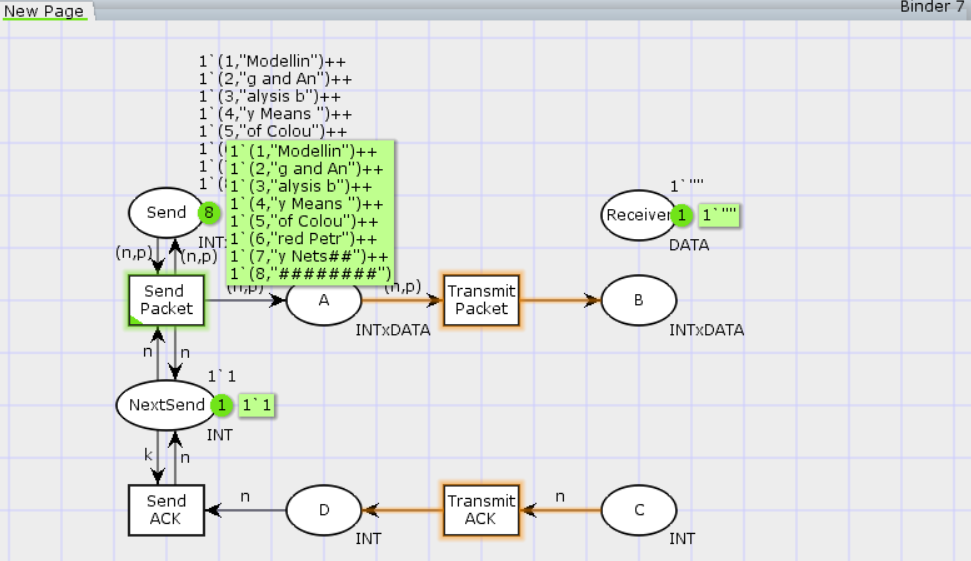
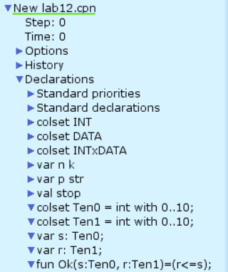
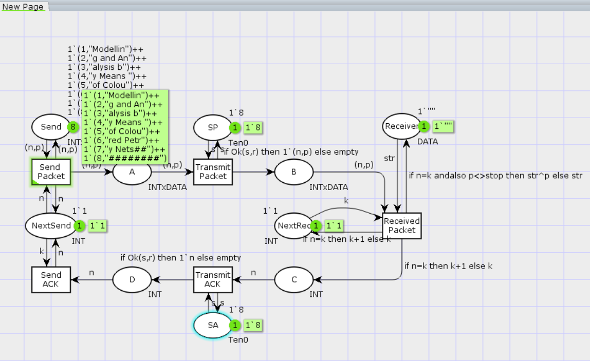

---
## Front matter
lang: ru-RU
title: Лабораторная работа 12
subtitle: Пример моделирования простого протокола передачи данных
author:
  - Ланцова Я. И.
institute:
  - Российский университет дружбы народов, Москва, Россия

## i18n babel
babel-lang: russian
babel-otherlangs: english

## Formatting pdf
toc: false
toc-title: Содержание
slide_level: 2
aspectratio: 169
section-titles: true
theme: metropolis
header-includes:
 - \metroset{progressbar=frametitle,sectionpage=progressbar,numbering=fraction}
 - '\makeatletter'
 - '\beamer@ignorenonframefalse'
 - '\makeatother'
---

# Информация

## Докладчик

:::::::::::::: {.columns align=center}
::: {.column width="70%"}

  * Ланцова Яна Игоревна
  * студентка
  * Российский университет дружбы народов

:::
::::::::::::::

## Цель работы

Реализовать в CPN Tools простой протокол передачи данных и провести анализ.

## Задание

- Реализовать в CPN Tools простой протокол передачи данных.
- Вычислить пространство состояний, сформировать отчет о нем и построить граф.

# Выполнение лабораторной работы

## Выполнение лабораторной работы

{#fig:001 width=50%}

## Выполнение лабораторной работы

{#fig:002 width=40%}

## Выполнение лабораторной работы

{#fig:003 width=50%}

## Выполнение лабораторной работы

{#fig:004 width=30%}

## Выполнение лабораторной работы

{#fig:005 width=50%}

## Выполнение лабораторной работы

{#fig:006 width=50%}

## Выполнение лабораторной работы

```
CPN Tools state space report for:
/cygdrive/C/Users/yalan/Downloads/folder/lab12.cpn
Report generated: Wed Apr 23 14:29:17 2025


 Statistics
------------------------------------------------------------------------

  State Space
     Nodes:  34017
     Arcs:   566375
     Secs:   300
     Status: Partial
```

## Выполнение лабораторной работы

```
  Scc Graph
     Nodes:  17822
     Arcs:   475545
     Secs:   6


 Boundedness Properties
------------------------------------------------------------------------
```

## Выполнение лабораторной работы

{#fig:007 width=50%}

## Выводы

В результате выполнения работы был реализован в CPN Tools простой протокол передачи данных и проведен анализ его пространства состояний.
