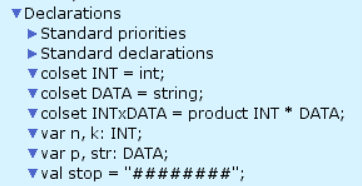
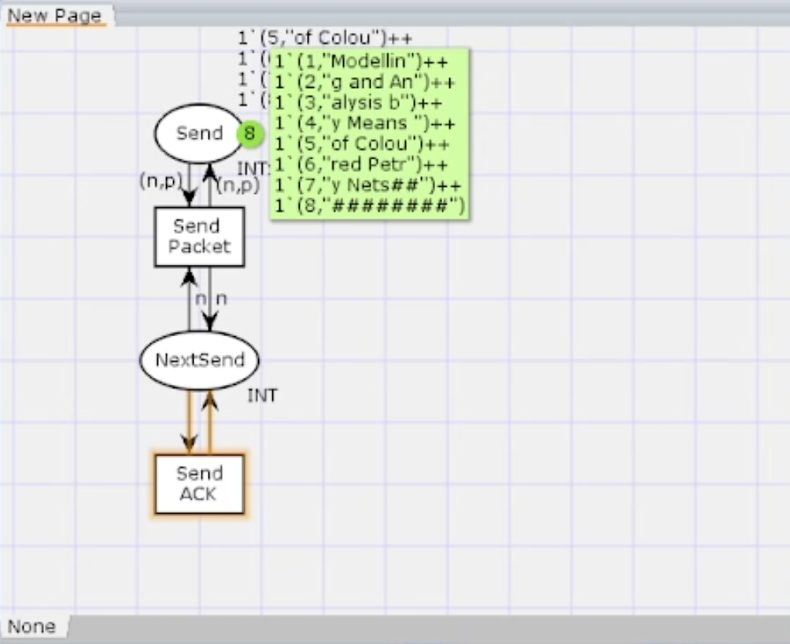
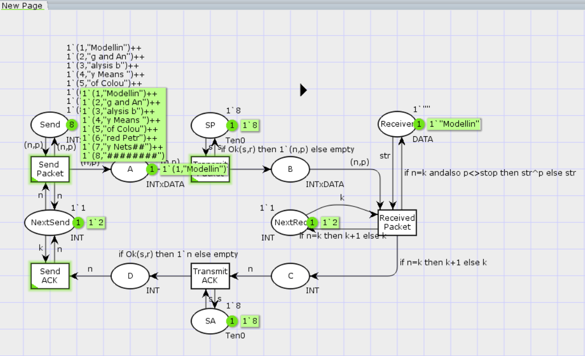
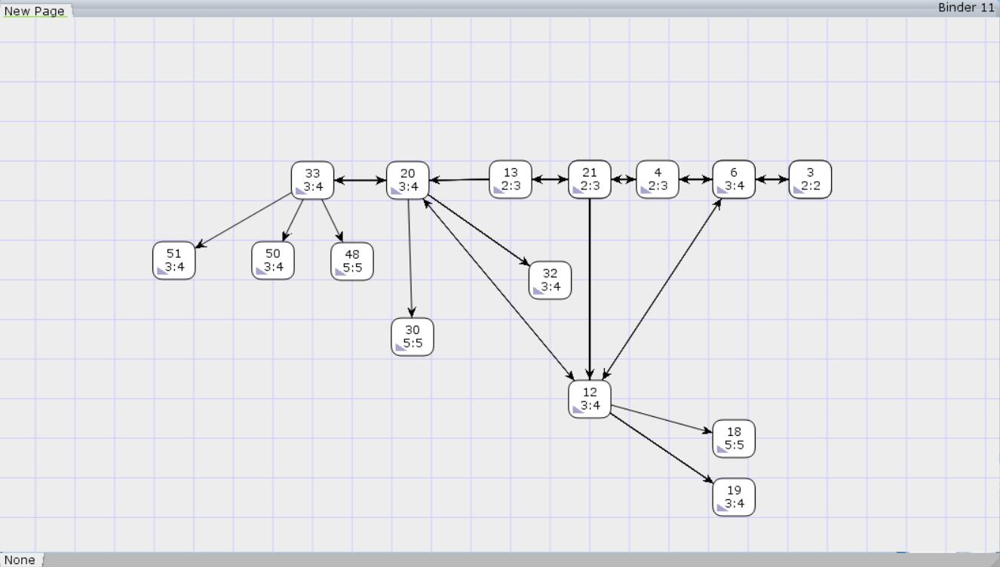

---
## Front matter
title: "Лабораторная работа №12"
subtitle: "Пример моделирования простого протокола передачи данных"
author: "Ланцова Яна Игоревна"

## Generic otions
lang: ru-RU
toc-title: "Содержание"

## Bibliography
bibliography: bib/cite.bib
csl: pandoc/csl/gost-r-7-0-5-2008-numeric.csl

## Pdf output format
toc: true # Table of contents
toc-depth: 2
lof: true # List of figures
lot: true # List of tables
fontsize: 12pt
linestretch: 1.5
papersize: a4
documentclass: scrreprt
## I18n polyglossia
polyglossia-lang:
  name: russian
  options:
    - spelling=modern
    - babelshorthands=true
polyglossia-otherlangs:
  name: english
## I18n babel
babel-lang: russian
babel-otherlangs: english
## Fonts
mainfont: IBM Plex Serif
romanfont: IBM Plex Serif
sansfont: IBM Plex Sans
monofont: IBM Plex Mono
mathfont: STIX Two Math
mainfontoptions: Ligatures=Common,Ligatures=TeX,Scale=0.94
romanfontoptions: Ligatures=Common,Ligatures=TeX,Scale=0.94
sansfontoptions: Ligatures=Common,Ligatures=TeX,Scale=MatchLowercase,Scale=0.94
monofontoptions: Scale=MatchLowercase,Scale=0.94,FakeStretch=0.9
mathfontoptions:
## Biblatex
biblatex: true
biblio-style: "gost-numeric"
biblatexoptions:
  - parentracker=true
  - backend=biber
  - hyperref=auto
  - language=auto
  - autolang=other*
  - citestyle=gost-numeric
## Pandoc-crossref LaTeX customization
figureTitle: "Рис."
tableTitle: "Таблица"
listingTitle: "Листинг"
lofTitle: "Список иллюстраций"
lotTitle: "Список таблиц"
lolTitle: "Листинги"
## Misc options
indent: true
header-includes:
  - \usepackage{indentfirst}
  - \usepackage{float} # keep figures where there are in the text
  - \floatplacement{figure}{H} # keep figures where there are in the text
---

# Цель работы

Реализовать в CPN Tools простой протокол передачи данных и провести анализ.

# Задание

- Реализовать в CPN Tools простой протокол передачи данных.
- Вычислить пространство состояний, сформировать отчет о нем и построить граф.

# Выполнение лабораторной работы

## Реализация модели системы массового обслуживания M|M|1 в CPN Tools

Основные состояния: источник (Send), получатель (Receiver). Действия (переходы): отправить пакет (Send Packet), отправить подтверждение (Send ACK). Промежуточное состояние: следующий посылаемый пакет (NextSend). Зададим декларации модели(рис. [-@fig:001]).

{#fig:001 width=70%}

Состояние Send имеет тип INTxDATA и следующую начальную маркировку (в соответствии с передаваемой фразой).

Стоповый байт ("########") определяет, что сообщение закончилось. Состояние Receiver имеет тип DATA и начальное значение 1'"" (т.е. пустая строка, поскольку состояние собирает данные и номер пакета его не интересует). Состояние NextSend имеет тип INT и начальное значение 1'1. Поскольку пакеты представляют собой кортеж, состоящий из номера пакета и строки, то выражение у двусторонней дуги будет иметь значение (n,p). Кроме того, необходимо взаимодействовать с состоянием, которое будет сообщать номер следующего посылаемого пакета данных. Поэтому переход Send Packet соединяем с состоянием NextSend двумя дугами с выражениями n (рис. 12.1). Также необходимо получать информацию с подтверждениями о получении данных. От перехода Send Packet к состоянию NextSend дуга с выражением n, обратно -- k.

Построим начальный граф(рис. [-@fig:002]):

{#fig:002 width=70%}

Зададим промежуточные состояния (A, B с типом INTxDATA, C, D с типом INTxDATA) для переходов: передать пакет Transmit Packet (передаём (n,p)), передать подтверждение Transmit ACK (передаём целое число k). Добавляем переход получения пакета (Receive Packet). От состояния Receiver идёт дуга к переходу Receive Packet со значением той строки (str), которая находится в состоянии Receiver. Обратно: проверяем, что номер пакета новый и строка не равна стоп-биту. Если это так, то строку добавляем к полученным данным. Кроме того, необходимо знать, каким будет номер следующего пакета. Для этого добавляем состояние NextRec с типом INT и начальным значением 1'1 (один пакет), связываем его дугами с переходом Receive Packet. Причём к переходу идёт дуга с выражением k, от перехода — if n=k then k+1 else k. Связываем состояния B и C с переходом Receive Packet. От состояния B к переходу Receive Packet — выражение (n,p), от перехода Receive Packet к состоянию C — выражение if n=k then k+1 else k. От перехода Receive Packet к состоянию Receiver: if n=k andalso p<>stop then str^p else str. (если n=k и мы не получили стоп-байт, то направляем в состояние строку и к ней прикрепляем p, в противном случае посылаем толко строку).  На переходах Transmit Packet и Transmit ACK зададим потерю пакетов. Для этого на интервале от 0 до 10 зададим пороговое значение и, если передаваемое значение превысит этот порог, то считаем, что произошла потеря пакета, если нет, то передаём пакет дальше. Для этого задаём вспомогательные состояния SP и SA с типом Ten0, соединяем с соответствующими переходами (рис. [-@fig:003]):

{#fig:003 width=70%}

В декларациях задаём(рис. [-@fig:004]):

{#fig:004 width=70%}

Таким образом, получим модель простого протокола передачи данных. Пакет последовательно проходит: состояние Send, переход Send Packet, состояние A, с некоторой вероятностью переход Transmit Packet, состояние B, попадает на переход Receive Packet, где проверяется номер пакета и если нет совпадения, то пакет направляется в состояние Received, а номер пакета передаётся последовательно в состояние C, с некоторой вероятностью в переход Transmit ACK, далее в состояние D, переход Receive ACK, состояние NextSend (увеличивая на 1 номер следующего пакета), переход Send Packet. Так продолжается до тех пор, пока не будут переданы все части сообщения. Последней будет передана стоппоследовательность(рис. [-@fig:005]):

{#fig:005 width=70%}

После запуска модели можно увидеть следующее (рис. [-@fig:006]).

{#fig:006 width=70%}

## Мониторинг параметров моделируемой системы

Затем сформируем отчет пространства состояний. Из него может увидеть:

- есть 34017 состояний и 566375 переходов между ними, в графе строго соединенных компонент 17822 узлов и 475545 дуг.
- Затем указаны границы значений для каждого элемента: промежуточные состояния A, B, C, вспомогательные состояния SP, SA, NextRec, NextSend, Receiver(в них может находиться только один пакет) и состояние Send(в нем хранится только 8 элементов, так как мы задали их в начале и с ними никаких изменений не происходит).
- Также указаны границы в виде мультимножеств.
- Маркировка home для всех состояний, так как в любую позицию мы можем попасть из любой другой маркировки.
- Маркировка dead равная 11948 [34017,34016,34015,34014,34013,...] -- это состояния, в которых нет включенных переходов(связано с условными конструкциями).
- В конце указано, что бесконечно часто могут происходит(Impartial Transition Instances)ь события Send_Packet и Transmit_Packet(они позволяют сети всегда передавать данные). Также указаны Transition Instances with No Fairness: Send_ACK, Transmit_ACK, Received_Packet. В них возможны бесконечные последовательности, но не срабатывают.

```
CPN Tools state space report for:
/cygdrive/C/Users/yalan/Downloads/folder/lab12.cpn
Report generated: Wed Apr 23 14:29:17 2025


 Statistics
------------------------------------------------------------------------

  State Space
     Nodes:  34017
     Arcs:   566375
     Secs:   300
     Status: Partial

  Scc Graph
     Nodes:  17822
     Arcs:   475545
     Secs:   6


 Boundedness Properties
------------------------------------------------------------------------

  Best Integer Bounds
                             Upper      Lower
     New_Page'A 1            22         0
     New_Page'B 1            11         0
     New_Page'C 1            7          0
     New_Page'D 1            5          0
     New_Page'NextRec 1      1          1
     New_Page'NextSend 1     1          1
     New_Page'Receiver 1     1          1
     New_Page'SA 1           1          1
     New_Page'SP 1           1          1
     New_Page'Send 1         8          8

  Best Upper Multi-set Bounds
     New_Page'A 1        22`(1,"Modellin")++
18`(2,"g and An")++
13`(3,"alysis b")++
8`(4,"y Means ")++
3`(5,"of Colou")
     New_Page'B 1        11`(1,"Modellin")++
9`(2,"g and An")++
6`(3,"alysis b")++
4`(4,"y Means ")++
1`(5,"of Colou")
     New_Page'C 1        7`2++
6`3++
4`4++
2`5++
1`6
     New_Page'D 1        5`2++
4`3++
3`4++
2`5
     New_Page'NextRec 1  1`1++
1`2++
1`3++
1`4++
1`5++
1`6
     New_Page'NextSend 1 1`1++
1`2++
1`3++
1`4++
1`5
     New_Page'Receiver 1 1`""++
1`"Modellin"++
1`"Modelling and An"++
1`"Modelling and Analysis b"++
1`"Modelling and Analysis by Means "++
1`"Modelling and Analysis by Means of Colou"
     New_Page'SA 1       1`8
     New_Page'SP 1       1`8
     New_Page'Send 1     1`(1,"Modellin")++
1`(2,"g and An")++
1`(3,"alysis b")++
1`(4,"y Means ")++
1`(5,"of Colou")++
1`(6,"red Petr")++
1`(7,"y Nets##")++
1`(8,"########")

  Best Lower Multi-set Bounds
     New_Page'A 1        empty
     New_Page'B 1        empty
     New_Page'C 1        empty
     New_Page'D 1        empty
     New_Page'NextRec 1  empty
     New_Page'NextSend 1 empty
     New_Page'Receiver 1 empty
     New_Page'SA 1       1`8
     New_Page'SP 1       1`8
     New_Page'Send 1     1`(1,"Modellin")++
1`(2,"g and An")++
1`(3,"alysis b")++
1`(4,"y Means ")++
1`(5,"of Colou")++
1`(6,"red Petr")++
1`(7,"y Nets##")++
1`(8,"########")


 Home Properties
------------------------------------------------------------------------

  Home Markings
     None


 Liveness Properties
------------------------------------------------------------------------

  Dead Markings
     11948 [34017,34016,34015,34014,34013,...]

  Dead Transition Instances
     None

  Live Transition Instances
     None


 Fairness Properties
------------------------------------------------------------------------

  Impartial Transition Instances
     New_Page'Send_Packet 1
     New_Page'Transmit_Packet 1

  Fair Transition Instances
     None

  Just Transition Instances
     None

  Transition Instances with No Fairness
     New_Page'Received_Packet 1
     New_Page'Send_ACK 1
     New_Page'Transmit_ACK 1

```

Сформируем начало графа пространства состояний, так как их много(рис. [-@fig:007]):

{#fig:007 width=70%}

# Выводы

В результате выполнения работы был реализован в CPN Tools простой протокол передачи данных и проведен анализ его пространства состояний.
