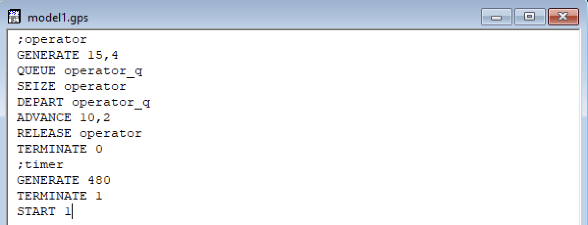
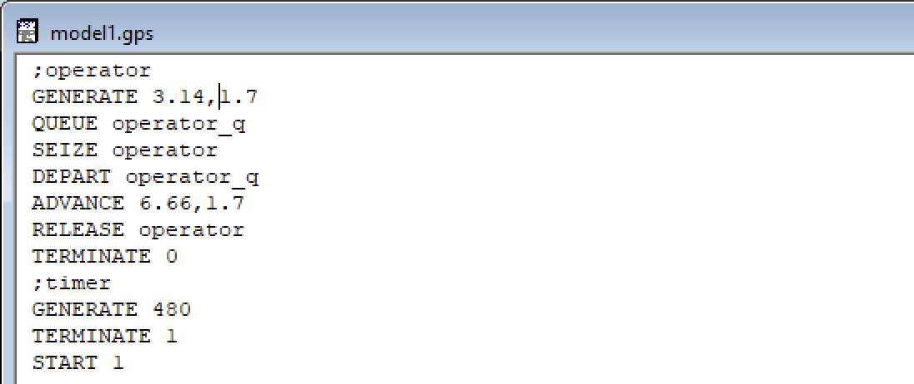
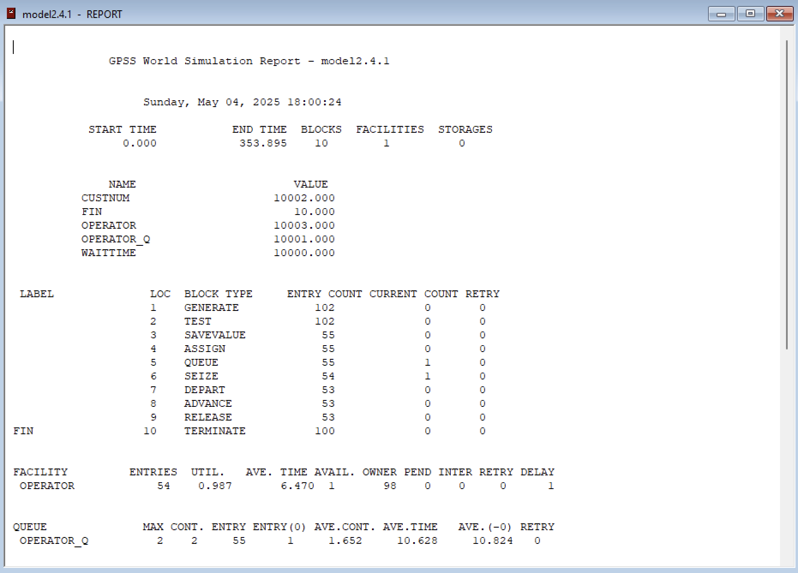
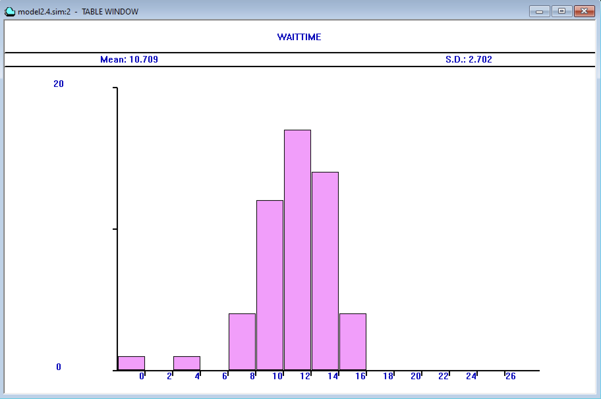
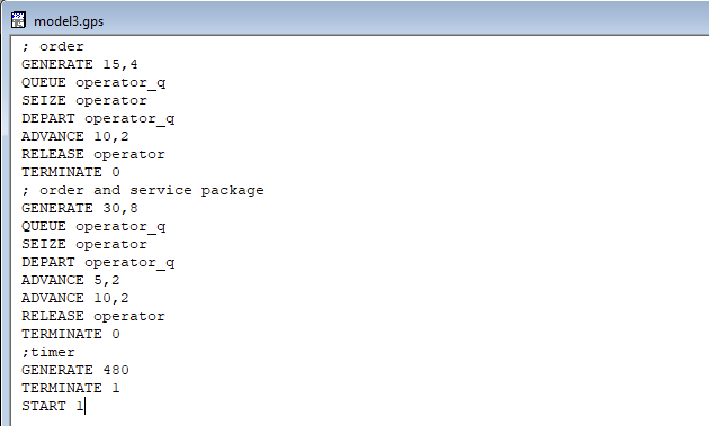
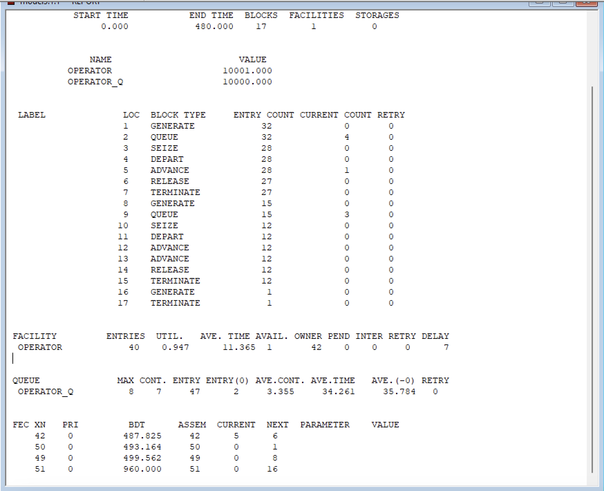
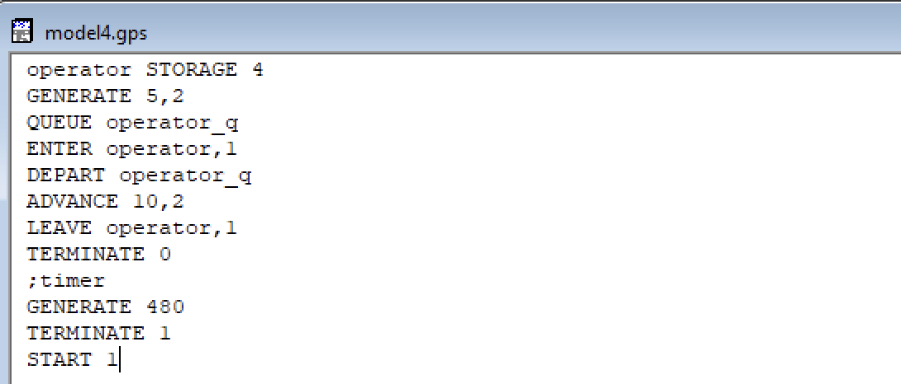
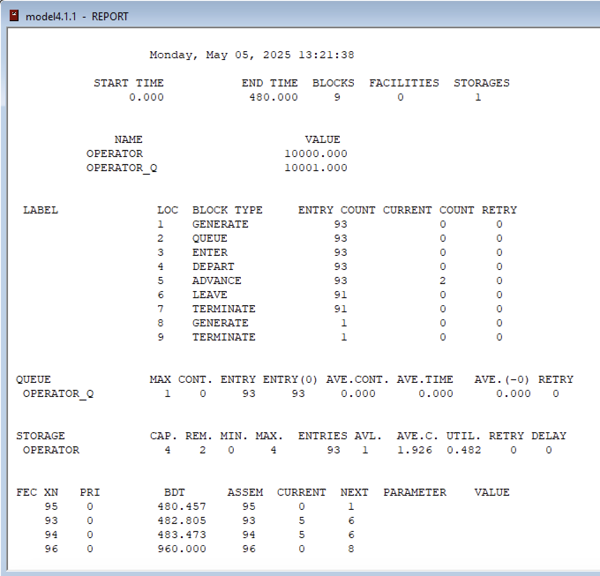
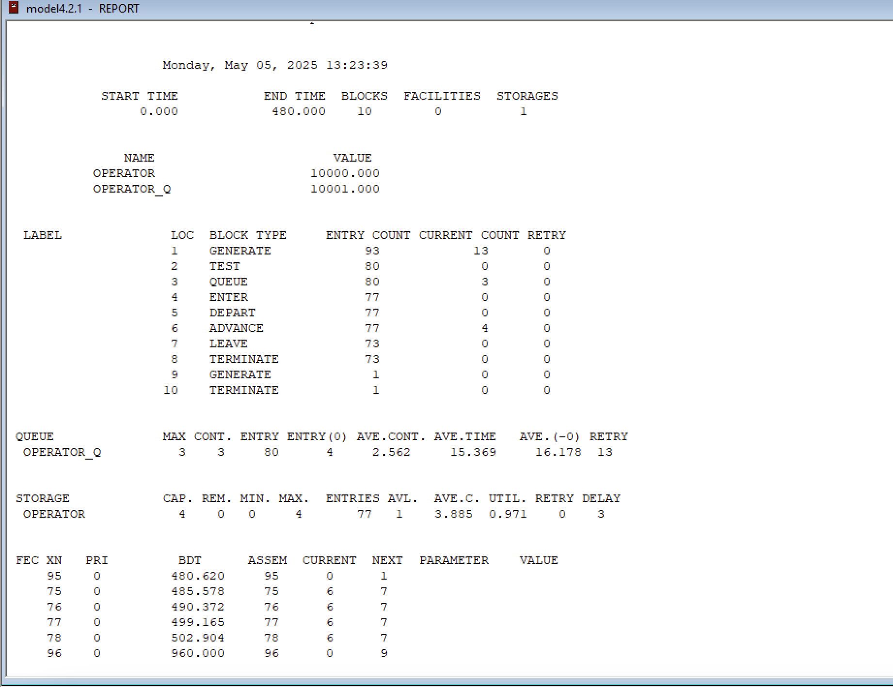

---
## Front matter
lang: ru-RU
title: Лабораторная работа 14
subtitle: Модели обработки заказов
author:
  - Ланцова Я. И.
institute:
  - Российский университет дружбы народов, Москва, Россия

## i18n babel
babel-lang: russian
babel-otherlangs: english

## Formatting pdf
toc: false
toc-title: Содержание
slide_level: 2
aspectratio: 169
section-titles: true
theme: metropolis
header-includes:
 - \metroset{progressbar=frametitle,sectionpage=progressbar,numbering=fraction}
 - \usepackage{fontspec}
 - \usepackage{polyglossia}
 - \setmainlanguage{russian}
 - \setotherlanguage{english}
 - \newfontfamily\cyrillicfont{Arial}
 - \newfontfamily\cyrillicfontsf{Arial}
 - \newfontfamily\cyrillicfonttt{Arial}
 - \setmainfont{Arial}
 - \setsansfont{Arial}
---

# Информация

## Докладчик

:::::::::::::: {.columns align=center}
::: {.column width="70%"}

  * Ланцова Яна Игоревна
  * студентка
  * Российский университет дружбы народов

:::
::::::::::::::

## Цель работы

Реализовать разные модели обслуживания клиентов и провести анализ результатов.

## Задание

Реализовать с помощью gpss:

- модель оформления заказов клиентов одним оператором с разными входными данными
- построение гистограммы распределения заявок в очереди
- модель обслуживания двух типов заказов от клиентов в интернет-магазине
- одель оформления заказов несколькими операторами

# Выполнение лабораторной работы

# Модель оформления заказов клиентов одним оператором

## Выполнение лабораторной работы

{#fig:001 width=70%}

## Выполнение лабораторной работы

{#fig:002 width=30%}

## Выполнение лабораторной работы

{#fig:003 width=70%}

## Выполнение лабораторной работы

{#fig:004 width=30%}

# Построение гистограммы распределения заявок в очереди

## Выполнение лабораторной работы

{#fig:005 width=70%}

## Выполнение лабораторной работы

{#fig:006 width=30%}

## Выполнение лабораторной работы

{#fig:007 width=50%}

## Выполнение лабораторной работы

{#fig:008 width=40%}

# Модель обслуживания двух типов заказов от клиентов в интернет-магазине

## Выполнение лабораторной работы

{#fig:009 width=50%}

## Выполнение лабораторной работы

{#fig:010 width=30%}

## Выполнение лабораторной работы

{#fig:011 width=60%}

## Выполнение лабораторной работы

{#fig:012 width=30%}

# Модель оформления заказов несколькими операторами

## Выполнение лабораторной работы

{#fig:013 width=60%}

## Выполнение лабораторной работы

{#fig:014 width=30%}

## Выполнение лабораторной работы

{#fig:015 width=60%}

## Выполнение лабораторной работы

{#fig:016 width=40%}

## Выводы

В результате выполнения работы были реализованы с помощью gpss:

  - модель оформления заказов клиентов одним оператором с разными входными данными
  - построение гистограммы распределения заявок в очереди
  - модель обслуживания двух типов заказов от клиентов в интернет-магазине
  - одель оформления заказов несколькими операторами
