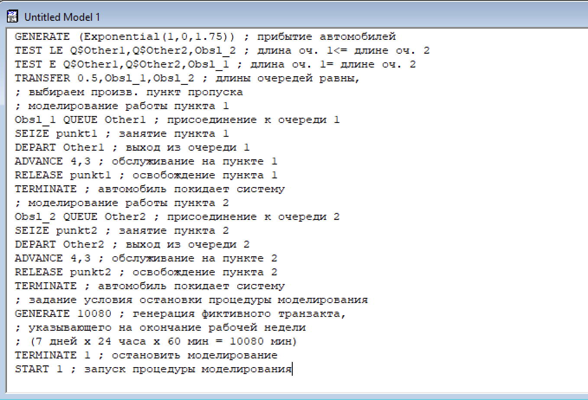
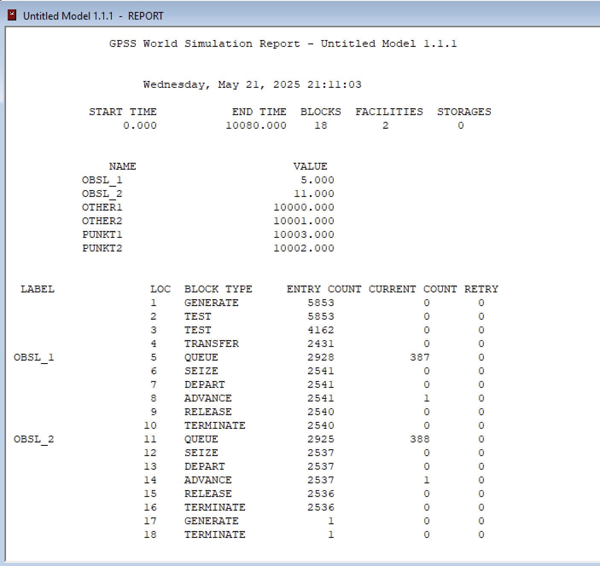
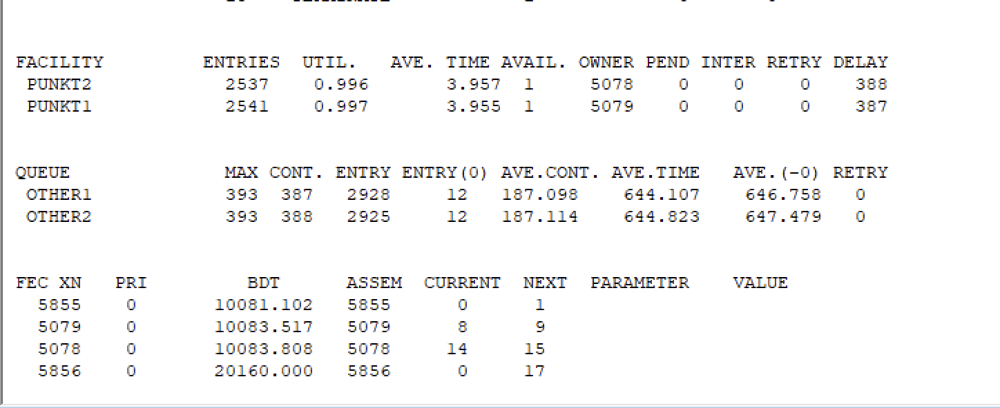
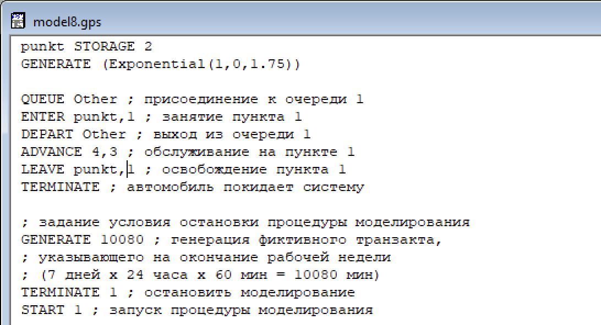
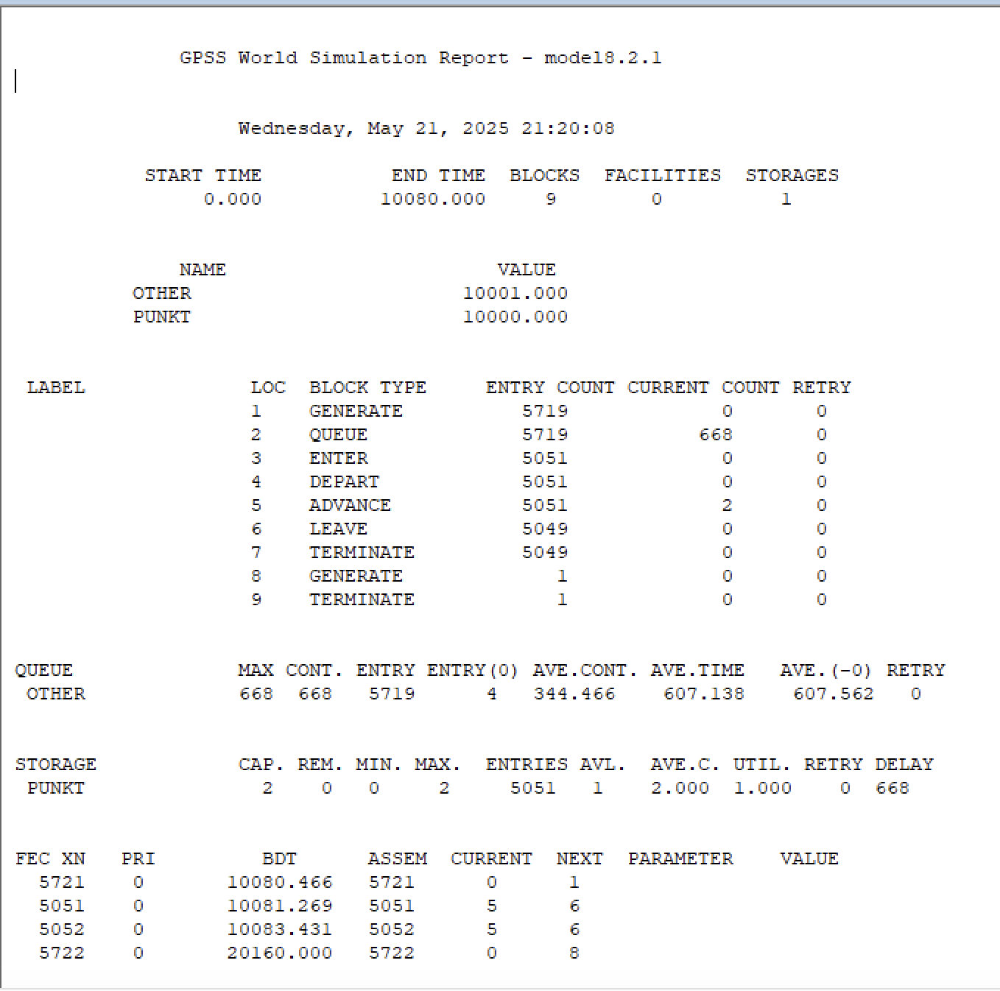
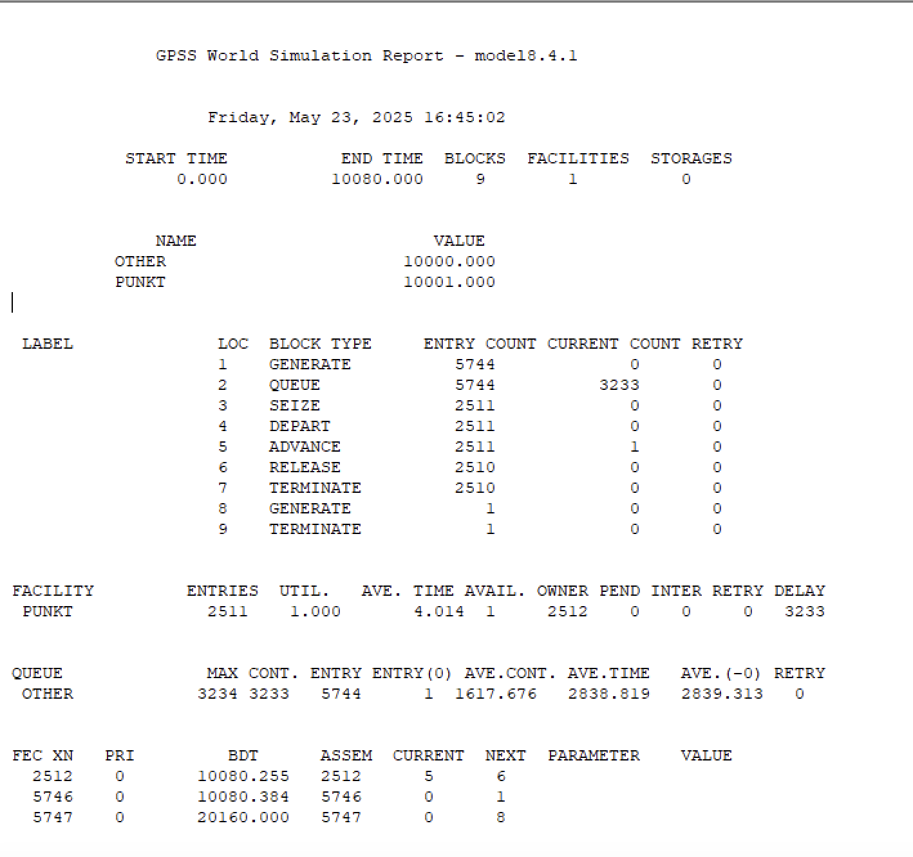
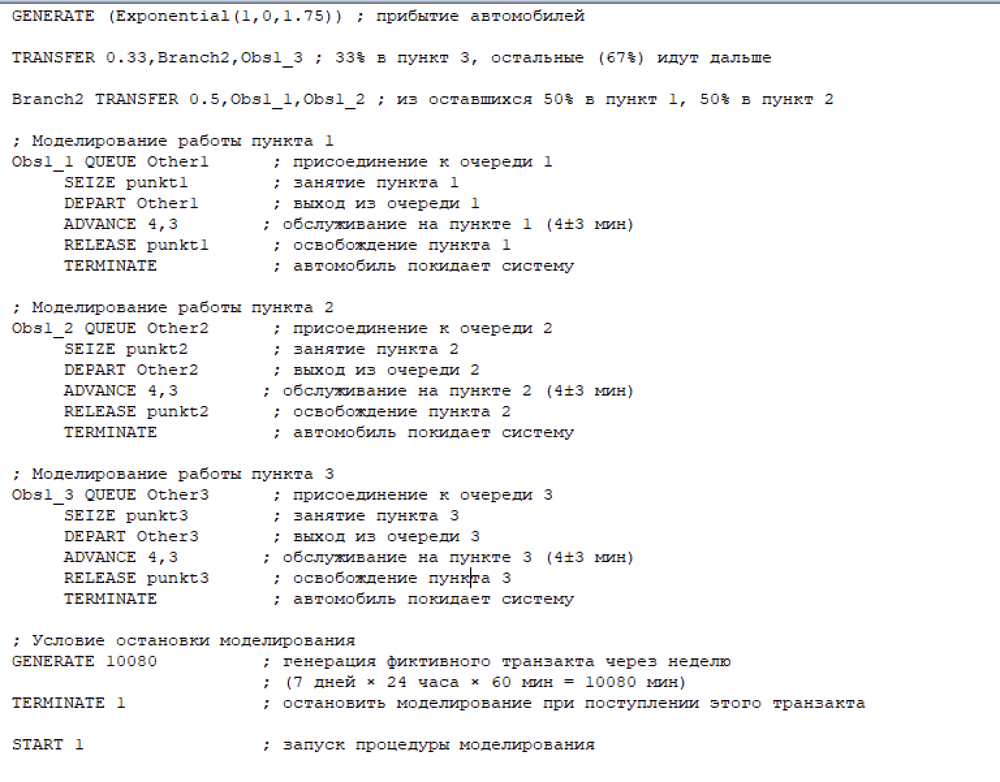
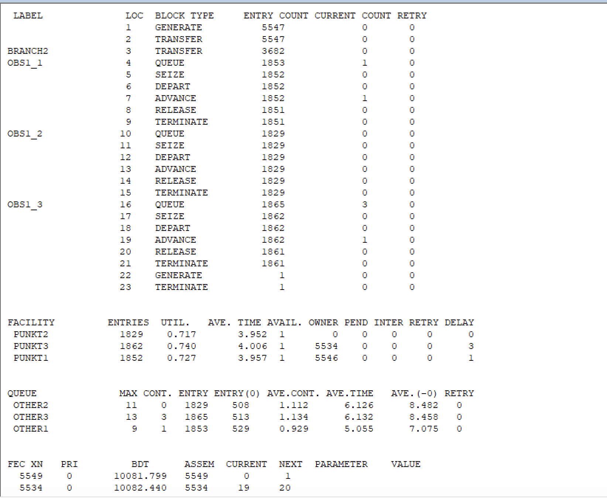
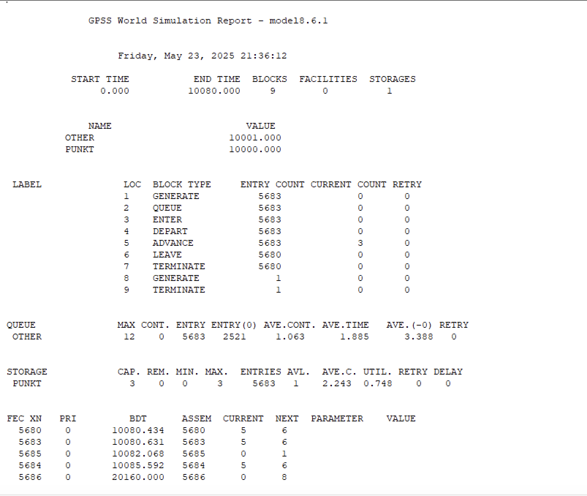
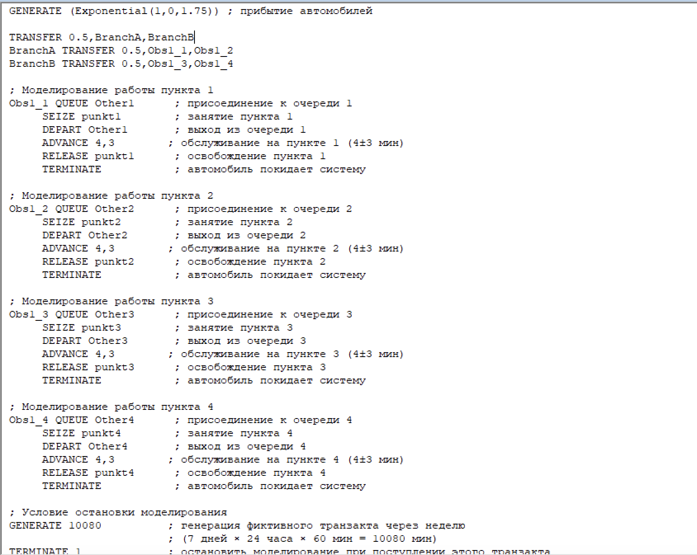

---
## Front matter
title: "Лабораторная работа №16"
subtitle: "Задачи оптимизации. Модель двух стратегий обслуживания"
author: "Ланцова Яна Игоревна"

## Generic otions
lang: ru-RU
toc-title: "Содержание"

## Bibliography
bibliography: bib/cite.bib
csl: pandoc/csl/gost-r-7-0-5-2008-numeric.csl

## Pdf output format
toc: true # Table of contents
toc-depth: 2
lof: true # List of figures
lot: true # List of tables
fontsize: 12pt
linestretch: 1.5
papersize: a4
documentclass: scrreprt
## I18n polyglossia
polyglossia-lang:
  name: russian
  options:
    - spelling=modern
    - babelshorthands=true
polyglossia-otherlangs:
  name: english
## I18n babel
babel-lang: russian
babel-otherlangs: english
## Fonts
mainfont: IBM Plex Serif
romanfont: IBM Plex Serif
sansfont: IBM Plex Sans
monofont: IBM Plex Mono
mathfont: STIX Two Math
mainfontoptions: Ligatures=Common,Ligatures=TeX,Scale=0.94
romanfontoptions: Ligatures=Common,Ligatures=TeX,Scale=0.94
sansfontoptions: Ligatures=Common,Ligatures=TeX,Scale=MatchLowercase,Scale=0.94
monofontoptions: Scale=MatchLowercase,Scale=0.94,FakeStretch=0.9
mathfontoptions:
## Biblatex
biblatex: true
biblio-style: "gost-numeric"
biblatexoptions:
  - parentracker=true
  - backend=biber
  - hyperref=auto
  - language=auto
  - autolang=other*
  - citestyle=gost-numeric
## Pandoc-crossref LaTeX customization
figureTitle: "Рис."
tableTitle: "Таблица"
listingTitle: "Листинг"
lofTitle: "Список иллюстраций"
lotTitle: "Список таблиц"
lolTitle: "Листинги"
## Misc options
indent: true
header-includes:
  - \usepackage{indentfirst}
  - \usepackage{float} # keep figures where there are in the text
  - \floatplacement{figure}{H} # keep figures where there are in the text
---

# Цель работы

Реализовать с помощью gpss модель двух стратегий обслуживания и оценить оптимальные параметрыю

# Задание

Реализовать с помощью gpss:

- модель с двумя очередями
- модель с одной очередью
- изменить модели для 1-4 пропускных пунктов и выбрать оптимальное количество

# Выполнение лабораторной работы

## Модель двух стратегий обслуживания

На пограничном контрольно-пропускном пункте транспорта имеются 2 пункта пропуска. Интервалы времени между поступлением автомобилей имеют экспоненциальное распределение со средним значением μ. Время прохождения автомобилями пограничного контроля имеет равномерное распределение на интервале [a, b]. 

Предлагается две стратегии обслуживания прибывающих автомобилей:

1) автомобили образуют две очереди и обслуживаются соответствующими пунктами
пропуска;
2) автомобили образуют одну общую очередь и обслуживаются освободившимся
пунктом пропуска.

Целью моделирования является определение:
- характеристик качества обслуживания автомобилей, в частности, средних длин очередей; среднего времени обслуживания автомобиля; среднего времени пребы- вания автомобиля на пункте пропуска;
- наилучшей стратегии обслуживания автомобилей на пункте пограничного контроля;
- оптимального количества пропускных пунктов.

В качестве критериев, используемых для сравнения стратегий обслуживания автомобилей, выберем:
- коэффициенты загрузки системы;
- максимальные и средние длины очередей;
- средние значения времени ожидания обслуживания.

Для первой стратегии обслуживания, когда прибывающие автомобили образуют две очереди и обслуживаются соответствующими пропускными пунктами, имеем следующую модель:(рис. [-@fig:001]).

{#fig:001 width=70%}

После запуска симуляции получаем отчёт(рис. [-@fig:002], [-@fig:003]).

{#fig:002 width=70%}

{#fig:003 width=70%}

Составим модель для второй стратегии обслуживания, когда прибывающие автомобили образуют одну очередь и обслуживаются освободившимся пропускным пунктом(рис. [-@fig:004]).

{#fig:004 width=70%}

Получим отчет(рис. [-@fig:005]).

{#fig:005 width=70%}

По результатам составим таблицу с приоритетной для нас информацией по обеим очередям(табл. [-@tbl:v]).

: Сравнение стратегий {#tbl:v}:

| Показатель                 | стратегия 1 |         |          |  стратегия 2 |
|----------------------------|-------------|---------|----------|--------------|
|                            | пункт 1     | пункт 2 | в целом  |              |
| Поступило автомобилей      | 2928        | 2925    | 5853     | 5719         |
| Обслужено автомобилей      | 2540        | 2536    | 5076     | 5049         |
| Коэффициент загрузки       | 0,997       | 0,996   | 0,9965   | 1            |
| Максимальная длина очереди | 393         | 393     | 786      | 668          |
| Средняя длина очереди      | 187,098     | 187,114 | 374,212  | 344,466      |
| Среднее время ожидания     | 644,107     | 644,823 | 644,465  | 607,138      |

Хотя при первой стратегии было обслужено больше автомоибелей, но разница между поступившими и обслужеными больше при применении второй стратегии, то есть она обслуживает эффективнее. Кроме того коэффициент загрузки равняется 1, то есть обслуживание происходит без перерыва. Также для второй стратегии максимальная, средняя длина очереди и среднее время ожидания меньше, так что можно сказать, что вторая стратегия лучше.

## Оптимизация модели двух стратегий обслуживания

Изменим модели, чтобы определить оптимальное число пропускных пунктов (от 1 до 4). Будем подбирать под следующие критерии:

- коэффициент загрузки пропускных пунктов принадлежит интервалу [0,5; 0,95];
- среднее число автомобилей, одновременно находящихся на контрольно пропускном пункте, не должно превышать 3;
- среднее время ожидания обслуживания не должно превышать 4 мин.

Для обеих стратегий модель с одним пунктом выглядит одинаково(рис. [-@fig:006], [-@fig:007]).

{#fig:006 width=70%}

{#fig:007 width=70%}

В этом случае модель не прохоит ни по одному из критериев, так как коэффициент загрузки, размер очереди и среднее время ожидания больше.

Построим модель для первой стратегии с 3 пропускными пунктами(рис. [-@fig:008], [-@fig:009]).

{#fig:008 width=70%}

{#fig:009 width=70%}

В этом случае среднее количество автомобилей в очереди меньше 3 и коэффициент загрузки в нужном диапазоне, но среднее время ожидания больше 4.

Построим модель для второй стратегии с 3 пропускными пунктами(рис. [-@fig:010], [-@fig:011]).

{#fig:010 width=70%}

{#fig:011 width=70%}

В этом случае все критерии выполняются, поэтому модель **оптимальна**.

Построим модель для первой стратегии с 4 пропускными пунктами(рис. [-@fig:012], [-@fig:013]).

{#fig:012 width=70%}

{#fig:013 width=70%}

В этом случае все критерии выполнены, поэтому 4 пункта являются **оптимальным** количеством для первой стратегии.

Построим модель для второй стратегии с 4 пропускными пунктами(рис. [-@fig:014], [-@fig:015]).

{#fig:014 width=70%}

{#fig:015 width=70%}

В этом случае также все критерии выполнены при этом время ожидания и среднее число автомобилей меньше, чем в случе второй стратегии с 3 пунтктами, однако загрузка меньше. Можно сделать вывод, что 4 пропускной пункт излишне разгружает систему и она простраивает.

В результате анализа наилучшим количеством пропускных пунктов можно назвать **3 при втором типе обслуживания**(одна очередь для всех пропускных пунктов) и **4 при певром.**

# Выводы

В результате выполнения работы были реализованы с помощью gpss:

- модель с двумя очередями
- модель с одной очередью
- изменение модели для 1-4 пропускных пунктов и выбрано оптимальное количество
